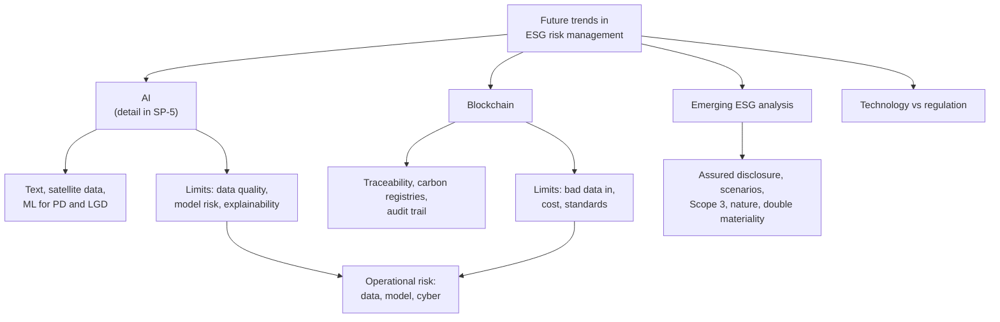

# RK-4 — Future Trends in ESG Risk Management

Covers: where AI fits in risk management (short, with a link to SP-5), blockchain for ESG transparency, emerging trends in ESG analysis, the technology-versus-regulation debate, and why technology is both a risk tool and a risk source. Slide coverage is thin, so most of this node is **(general)**. **(syllabus)**

## Where this fits in the ESE

The slides only name the topic, so the likely exam use is a **5-mark** "role of AI and blockchain in ESG risk management" or a **10-mark** discussion with the technology-vs-regulation debate. The Bhopal case (RK-5) can also use a "what could technology have changed" paragraph. Lower probability than RK-1 to RK-3, so read this last. **(syllabus)**

## The slide anchor: technology risk is operational risk

**(class)** The slides list data risk, model risk, third-party risk and cyber or system risk as major ESG sources of **operational risk** (RK-1). Every technology below reduces some of these and adds others, so answer both sides.

**Cambridge lens.** Cambridge Centre for Risk Studies (2019) puts Artificial Intelligence, Blockchain, Cryptocurrency and Cyber under its **Technology** class, and its review of emerging risks lists AI and big data and ethical use of technology among the key ones. So technology appears in the taxonomy as a risk type as well as a tool.

## AI in ESG risk management (general)

Detailed AI and ML methods, the HUL promise-versus-actual exercise and the limits are in [[Sustainable Finance Unit 3 - SP-5 AI and ML in Sustainable Finance]]. Do not duplicate them. For risk management, use this short list:

| Use | Risk step (RK-1 workflow) | Example |
|---|---|---|
| Text analysis of reports and news | Identify | Flag controversies and greenwashing language |
| Satellite and geospatial data | Identify, quantify | Map flood or heat exposure of factories and collateral |
| ML models with ESG inputs | Quantify | Better PD and LGD estimates (RK-2) |
| Automated data validation | Monitor | Lower the data-error KRI (RK-1) |

AI risks: biased or poor data, model risk, lack of explainability, over-reliance, and cost. These are the slide's data and model risks again.

## Blockchain for ESG transparency (general)

A blockchain is a shared ledger where entries are time-stamped and hard to alter. For ESG it offers:

1. **Supply-chain traceability:** record the origin of materials and labour conditions, which addresses supply-chain and third-party risk.
2. **Carbon credits and registries:** record issuance, ownership and retirement of credits to reduce **double counting** (the same credit claimed twice). Links to SP-4.
3. **Audit trail for ESG data:** entries cannot be quietly rewritten, which supports the slide's "verifiable" and "transparent" disclosure tests (RK-3).
4. **Smart contracts:** automatic payment when a verified target is met, for example a step-up in a sustainability-linked instrument. Treat this as a pilot-stage idea **[VERIFY]**.

Limits: **garbage in, garbage out** (a ledger records bad data permanently, and a link from the real world to the chain is needed); energy use of some designs; cost, privacy and weak standards; legal status unsettled.

## Emerging trends in ESG analysis (general)

| Trend | What it means | Link |
|---|---|---|
| Assured and standardised disclosure | Frameworks converge on a global baseline; assurance rises | RK-3 |
| Scenario analysis and stress tests as routine | Moves from optional to expected in risk reports | RK-2, CC-4 |
| Value-chain emissions | Scope 3 and financed emissions come into scope | CC-1 |
| Nature and biodiversity risk | Beyond carbon: water, land, ecosystems; a nature-related disclosure framework exists **[VERIFY]** | RK-1, Cambridge Environmental class |
| Double materiality | Both how ESG affects the firm and how the firm affects the world | FS-6 |
| Real-time and alternative data | News, satellite, supplier data replace annual reports | SP-5 |
| Transition plans | Credibility of the path to net zero is assessed | CC-2, CC-5 |
| Greenwashing enforcement | Regulators and courts act on misleading claims | CC-5 |

India: BRSR and assurance expectations are growing **[VERIFY current SEBI and RBI circulars before quoting dates]**.

## Debate: technology versus regulation (course-plan activity)

*Motion: technology, not regulation, will make ESG risk management work.*

| For technology | For regulation |
|---|---|
| Faster and cheaper data, finer risk detection | Sets one standard so data is comparable |
| Can reach firms regulators miss | Forces disclosure from reluctant firms |
| Improves with use | Gives penalties for greenwashing |
| Needs no new law to start | Ensures assurance and accountability |

**Balanced conclusion to write:** technology improves identification and monitoring (RK-1 steps 2 and 6), but it cannot replace common standards, assured data and penalties, so the two work together. Regulation sets the rules of the game; technology checks that the rules are followed.

### Worked example: an AI controversy screen

*Illustrative. A bank's ESG team screens 1,000 listed borrowers for serious controversies with an AI tool. In truth 80 have a serious controversy. The tool flags 50 firms; on manual review 40 of them are genuine.*

1. Precision = genuine flags ÷ flags = 40 ÷ 50 = **80%** (false alarms: 10).
2. Recall = genuine flags ÷ all genuine = 40 ÷ 80 = **50%** (missed: 40).
3. Both together: the tool finds half of the problems, and one flag in five is a false alarm.

| Measure | Value | Meaning |
|---|---|---|
| Precision | 80% | Most flags are worth reviewing |
| Recall | 50% | Half of the real controversies are missed |
| Missed cases | 40 | These remain unmanaged risk |

Decision line: **use the tool to prioritise the analyst's queue, not to clear the rest of the portfolio, because it misses half of the real cases.** Interpretation: AI helps with identification, but model risk (slide) remains, so keep human review, a second data source and a validation KRI. Compare SP-5.

## 5-mark and 10-mark skeletons

*5 marks: Role of AI and blockchain in ESG risk management.* AI uses with one example each (2); blockchain uses with one example (2); one limit for each, linked to data and model risk (1).

*10 marks: Discuss future trends in ESG risk management.* Why trends matter (1); AI (2); blockchain (2); emerging ESG analysis trends (3); technology-versus-regulation conclusion (1); link to operational risk and Cambridge technology class (1).

## What to remember

- The slides only name AI, blockchain and emerging ESG analysis; the content here is general.
- Technology is a tool against data, model, third-party and cyber risk, and also a source of them.
- AI: text analysis, satellite data, ML for PD and LGD. Blockchain: traceability, carbon-credit registries, audit trails.
- Limits: poor input data, explainability, energy and cost, weak standards.
- Trends: assured and standard disclosure, routine scenarios, value-chain and nature risk, double materiality.
- Technology and regulation are complements: technology detects, regulation sets standards and penalties.

## Concept map

## Flashcards
Q: Which slide operational-risk sources do AI and blockchain mainly address?
A: Data risk, model risk, third-party risk and cyber or system risk (as risks to manage and tools to manage them).

Q: Give two uses of AI in ESG risk identification.
A: Text analysis to flag controversies and greenwashing language; satellite or geospatial data to map flood or heat exposure.

Q: Name two limits of AI in ESG risk work.
A: Poor or biased input data and model risk or lack of explainability.

Q: What does blockchain add to ESG transparency?
A: A time-stamped shared ledger that gives traceability, an audit trail and a record of carbon-credit issuance and retirement.

Q: What is double counting in carbon credits and how can a ledger help?
A: The same credit claimed twice; a ledger records issuance, ownership and retirement so a credit can be claimed only once.

Q: Why is blockchain not a cure for ESG data quality?
A: It records whatever is entered, so bad data stays bad; the real-world data source still needs checking and assurance.

Q: Name three emerging trends in ESG analysis.
A: Any of: assured and standardised disclosure, routine scenario analysis, value-chain emissions, nature risk, double materiality, real-time data.

Q: Where does the Cambridge taxonomy place AI and blockchain?
A: In the Technology class, as disruptive-technology risk types (Cambridge Centre for Risk Studies, 2019).

Q: AI flags 50 firms, 40 genuine, 80 genuine exist. Precision and recall?
A: Precision 40 ÷ 50 = 80%; recall 40 ÷ 80 = 50%.

Q: One-line conclusion to the technology-versus-regulation debate?
A: Technology improves detection and monitoring, but regulation sets standards, assurance and penalties, so they complement each other.

## Sources
- Faculty deck Unit 4 (p 281 focus areas; pp 331, 362 operational risk sources)
- Cambridge Centre for Risk Studies (2019), Cambridge Taxonomy of Business Risks
- BBA304F-5 course plan, Module 4
- Related: [[Sustainable Finance Unit 3 - SP-5 AI and ML in Sustainable Finance]]
- Previous node: [[Sustainable Finance Unit 4 - RK-3 Risk Metrics Reporting and Disclosure]]
- Next node: [[Sustainable Finance Unit 4 - RK-5 Unit 4 Exam Answers]]
- [[Sustainable Finance Unit 4 - Risk MOC (Node Map)]]
