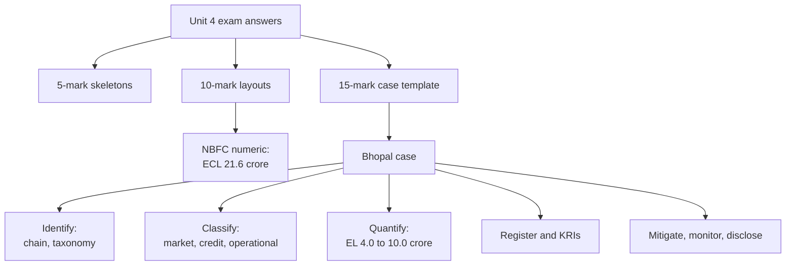

# RK-5 — Unit 4 Exam Answers

Covers: command words, 5-mark skeletons, 10-mark layouts (including the NBFC numeric), a reusable 15-mark case template, and the full 15-mark Bhopal answer built from the unit's risk tools. **(class)**

## The exam and how Unit 4 appears

ESE: 50 marks, 2 hours. Section A: 3 of 5 × 5 marks. Section B: 2 of 3 × 10 marks. Section C: one compulsory 15-mark case. Module 4 names the Bhopal gas tragedy (1984) as a case on social and governance risk, so it is the most likely case for this unit. Budget: about 7 minutes per 5-marker, 14 per 10-marker, 30 for the case. **(syllabus)**

Always write in the slide's words first: **the key principle** (ESG risk is often a driver of conventional financial risk, not necessarily a separate silo), the **transmission chain**, and **identify, assess, quantify, mitigate, monitor**.

## Section A: 5-mark skeletons (about 150 words each)

| Question | Skeleton |
|---|---|
| Three major risks with impact | Definition of ESG risk (1); market, credit, operational each with example and impact (3); overlap (1). RK-1 |
| Risk vs exposure | Definitions, focus, measurement, management, finance example (1 each). RK-1 |
| ESG transmission chain | Five links (2); carbon, flood, governance examples (2); link to PD or valuation (1). RK-1 |
| Expected loss | PD, LGD, EAD (2); EL = PD × LGD × EAD (1); slide example 0.02 × 0.40 × 1,000,000 = 8,000 (1); ESG effect (1). RK-2 |
| Scenario analysis vs stress testing | Definitions (2); slide examples (2); outputs (1). RK-2 |
| Good corporate ESG disclosure | Definition (1); stakeholders (1); six qualities (3). RK-3 |
| ESG metrics under E, S and G | Three from each pillar (3); threshold and owner (1); link to risk (1). RK-3 |
| AI and blockchain in risk management | Two uses each (2); two limits (2); link to data and model risk (1). RK-4 |

## Section B: 10-mark layouts

**1. Market, credit and operational risk (10).** Introduction and key principle (1); market: meaning, five drivers, impact, coal example (2); credit: meaning, PD, LGD, EAD, channels, example (2); operational: meaning, six sources, controls, example (2); comparative table with indicators (1); register or workflow (1); conclusion on overlap (1).

**2. ESG risk quantification (10).** Meaning and approaches (2); PD, LGD, EAD (2); EL formula and slide example (2); ESG effect on each component (2); one use: pricing, provisioning or capital (1); scenario and stress link (1).

**3. Frameworks and disclosure (10).** Need (1); five frameworks (3); TCFD pillars (1); stakeholders (1); six qualities (2); challenges (2).

**4. Risk identification process (10).** Why identification is first (1); taxonomy (1); transmission chain (2); six-step workflow (3); risk register columns and one worked row (2); Cambridge lens in one line (1).

### Section B numeric: the NBFC cyclone problem (10)

Layout to copy (full working in RK-2):

| Step | Working | Result |
|---|---|---|
| 1. Exposed book | 2,000 × 18% | ₹360 crore, EAD |
| 2. State assumptions | Collateral = loan; PD 15% (as in class) | |
| 3. Unrecoverable | 360 × 40% | ₹144 crore |
| 4. Collateral after | 360 − 144 | ₹216 crore |
| 5. Recovery rate and LGD | 216 ÷ 360; 1 − 0.60 | 60%; 40% |
| 6. ECL | 0.15 × 0.40 × 360 | ₹21.6 crore |
| 7. LTV | 360 ÷ 360; 360 ÷ 216 | 100%; 166.7% |

Decision line: **₹360 crore (18% of the book) is exposed; recovery falls to 60%; expected credit loss is ₹21.6 crore; LTV rises to 166.7%, so the NBFC should raise provisions, cap coastal exposure, require top-up collateral and insurance, and run cyclone scenarios.** Marks: exposure (2), recovery and LGD (3), ECL (2), LTV (1), interpretation and actions (2).

## Section C: the 15-mark case template

Use this for any Unit 4 case (a coal power company, a cement maker, a water-reliant manufacturer, or Bhopal). Spend about 30 minutes.

1. **Facts and framing (2).** Two lines on what happened and who is exposed; name the key principle.
2. **Identify (3).** Map ESG drivers to the slide taxonomy and draw the transmission chain.
3. **Classify (2).** Market, credit and operational impacts in one table, noting overlap.
4. **Quantify (3).** One numeric: expected loss before and after, or a stress test. State assumptions.
5. **Register and KRIs (2).** One or two register rows with owner, KRI, response.
6. **Mitigate, monitor, disclose (2).** Controls, covenants, insurance, engagement; the six disclosure tests.
7. **Conclusion with interpretation (1).** One decision sentence.

Marks are paid for interpretation as well as for arithmetic, so end each numeric with a decision line.

## Section C worked answer: the Bhopal gas tragedy (15 marks)

**Question (likely form):** *The 1984 Bhopal gas tragedy is a case of social and governance risk failure. Using the risk tools in Unit 4, analyse the risks, quantify the effect for a lender, and recommend how stakeholders should manage such risk today.*

**Facts to state (general) [VERIFY all figures before quoting]:** on the night of 2 to 3 December 1984 a leak of methyl isocyanate gas from the Union Carbide India Limited pesticide plant in Bhopal killed thousands and injured several lakh people; estimates of deaths differ by source. Widely reported contributing causes: safety systems not working or switched off, cost-cutting, reduced staffing and training, weak maintenance, no effective emergency plan, and dense housing near the plant. A settlement of US$470 million in 1989 and later legal proceedings followed **[VERIFY]**. Do not attach numbers to the company beyond what you can confirm.

### 1. Framing (2 marks)

Bhopal shows that a governance and safety failure becomes a financial and social catastrophe. It illustrates the key principle: the ESG failure (governance, safety, community) shows up as conventional operational, credit and market loss, not as a separate silo.

### 2. Identify: taxonomy and transmission chain (3 marks)

Chain (class slide, governance version): **governance failure** (cost-cutting, weak oversight) → **exposure** (hazardous plant beside a dense settlement) → **financial impact** (liability, compensation, regulatory action, loss of licence) → **risk event** (gas leak) → **loss** (reputation, funding constraints, sale of the business).

Taxonomy (RK-1): primarily **operational risk**, from the slide's sources: **process risk** (weak maintenance and approvals), **people** (reduced staffing and training), **systems** (safety systems failed) and external events. Cambridge lens (Cambridge Centre for Risk Studies, 2019): Technology class (industrial accident), Social class (community and occupational health) and **Governance class**, the class Cambridge finds most under-recognised in company risk registers. State that.

### 3. Classify: market, credit, operational (2 marks)

| Risk | Impact in a Bhopal-type event |
|---|---|
| Operational | Plant shutdown, deaths and injuries, legal penalties, loss of stakeholder trust (slide impacts) |
| Market | Share-price collapse, repricing risk, lower valuation, liquidity risk as investors exit |
| Credit | Higher PD from liability and lost cash flow; lower collateral and recovery (LGD); lower rating; higher borrowing cost |

Overlap: one event triggered all three at once (slide: overlap matters).

### 4. Quantify: lender's expected loss (3 marks)

*Illustrative. A hypothetical lender holds a ₹500 crore loan to a chemical company with a Bhopal-type safety weakness. This is not the figure of any real firm or of the actual case.*

| Step | Before the safety audit | After a safety-control failure is found |
|---|---|---|
| 1. PD | 2% | 4% (liability and shutdown risk) |
| 2. LGD | 40% | 50% (plant is a contaminated, hard-to-sell asset) |
| 3. EAD | ₹500 crore | ₹500 crore |
| 4. EL = PD × LGD × EAD | 0.02 × 0.40 × 500 = **₹4.0 crore** | 0.04 × 0.50 × 500 = **₹10.0 crore** |
| 5. EL as % of loan | 0.8% | 2.0% |

1. Change: 10.0 − 4.0 = ₹6.0 crore, or +150%.
2. Stress test (class, "major ESG-related legal penalty"): suppose a ₹150 crore one-off liability against net worth of ₹600 crore: 150 ÷ 600 = **25%** of net worth gone before any production loss.
3. Decision line: **expected loss rises from 0.8% to 2.0% of the loan and a single liability uses a quarter of net worth, so the lender should price for the higher EL, make safety audits and emergency plans loan covenants, require liability insurance and cap the exposure.**
4. Interpretation: a governance weakness, found early, changes PD and LGD together and so more than doubles EL; found after the event, it is a loss and not a price.

### 5. Register and KRIs (2 marks)

| ID | Driver | Type | Exposure | L | I | Score | Control | Owner | KRI | Response |
|---|---|---|---|---|---|---|---|---|---|---|
| B1 | Safety-system failure (governance) | Operational | Hazardous plant near homes | 3 | 5 | 15 high | Preventive maintenance | Plant head, board risk committee | Safety-system downtime days, overdue maintenance, near-miss count | Audit, capex, emergency plan |

*Scores are illustrative with the L × I scale of RK-1.* Other KRIs: staffing and training hours, safety audit findings, community complaints, incident count.

### 6. Mitigate, monitor and disclose (2 marks)

- **Mitigate:** maker-checker and independent safety audits, emergency preparedness with the community, insurance, siting rules, exposure limits and covenants for lenders.
- **Monitor:** KRIs with thresholds and escalation to the board; periodic reassessment (workflow steps 5 and 6).
- **Disclose:** report safety and incident metrics under a framework (BRSR, GRI, RK-3) that meets the six tests: accurate, relevant, comparable, consistent, transparent, verifiable; use third-party assurance.
- **Technology (RK-4):** sensors and AI alerts for early warning, but they supplement, not replace, governance and regulation.

### 7. Conclusion (1 mark)

**Bhopal shows that unidentified governance and safety risk is unmeasured, unpriced and unmanaged; Unit 4's tools (taxonomy, chain, register, EL, scenario and stress tests, disclosure) turn it into numbers a board and a lender can act on before the loss, not after it.**

## Activity frame: the ESG Risk War Room (class)

Faculty classroom activity, usable as a 15-mark case frame for any sector (bank, cement, automobile, textile or IT):
1. Pick a company or sector and identify **3 ESG drivers**, mapping each to market, credit and/or operational risk.
2. Build a **5 × 5 risk heat map** (likelihood by impact) and select the **top three** risks.
3. For each priority risk give **two KRIs and two mitigation actions**.
4. Close with a 3-minute "Chief Risk Officer" briefing: top risks, numbers, decision.

Example (cement, illustrative, scores L × I): carbon tax, market, 4 × 4 = 16; heat and water stress at plants, operational, 3 × 4 = 12; poor emissions disclosure, market repricing, 3 × 3 = 9. Top three are those, in that order. KRIs: emissions intensity, share of capex on low-carbon; water per tonne, plant downtime days; assurance coverage, rating changes. Mitigation: transition plan and efficiency capex; water recycling and site adaptation; assured BRSR disclosure and engagement.

## What to remember

- Write slide wording first: key principle, three risks, chain, workflow, EL formula.
- 5-marks: definition, example, link to the key principle. 10-marks: add a table and a worked line.
- Numeric: state assumptions (PD 15%, collateral = loan in the NBFC problem), show steps, add a decision line.
- 15-mark case: framing 2, identify 3, classify 2, quantify 3, register 2, mitigate and disclose 2, conclusion 1.
- Bhopal: operational and governance failure; mark facts [VERIFY]; illustrative lender numbers EL 4.0 to 10.0 crore.
- Interpretation earns marks, so finish every numeric with an action.

## Concept map

## Flashcards
Q: Give the 15-mark case layout with marks for Unit 4.
A: Framing 2, identify 3, classify 2, quantify 3, register and KRIs 2, mitigate and disclose 2, conclusion 1.

Q: What is the first line of any Unit 4 answer?
A: ESG risk is often a driver of conventional financial risk, not necessarily a separate silo; identification is the first control point.

Q: Which risk type is Bhopal primarily, using slide sources?
A: Operational risk: process, people and systems failure (safety systems, maintenance, staffing), with governance as the root cause.

Q: Write the governance transmission chain.
A: Governance failure, misreporting or weak controls, regulatory action or reputation loss, funding constraints.

Q: Illustrative lender: ₹500 crore, PD 2% to 4%, LGD 40% to 50%. EL before and after?
A: 0.02 × 0.40 × 500 = ₹4.0 crore; 0.04 × 0.50 × 500 = ₹10.0 crore, up 150%.

Q: Which Cambridge class is most under-recognised in company risk registers?
A: Governance (Cambridge Centre for Risk Studies, 2019).

Q: Which assumptions must you state in the NBFC problem?
A: PD 15% and collateral value equal to loan exposure; neither is given in the question.

Q: NBFC problem headline answers?
A: Exposed ₹360 crore, collateral after ₹216 crore, recovery 60%, LGD 40%, ECL ₹21.6 crore, LTV 100% to 166.7%.

Q: Name two KRIs a lender would track for a hazardous plant.
A: Safety-system downtime days and overdue maintenance (also near-miss count, safety audit findings, incident count).

Q: What ends every numeric answer in this unit?
A: A decision line that states the action and interprets the figure.

## Sources
- RK-1 to RK-4 of this unit; faculty deck Unit 4
- Cambridge Centre for Risk Studies (2019), Cambridge Taxonomy of Business Risks
- BBA304F-5 course plan, Module 4 (Bhopal case) 
- Bhopal facts: general knowledge, [VERIFY] before quoting
- Previous node: [[Sustainable Finance Unit 4 - RK-4 Future Trends in ESG Risk Management]]
- [[Sustainable Finance Unit 4 - Risk MOC (Node Map)]]
