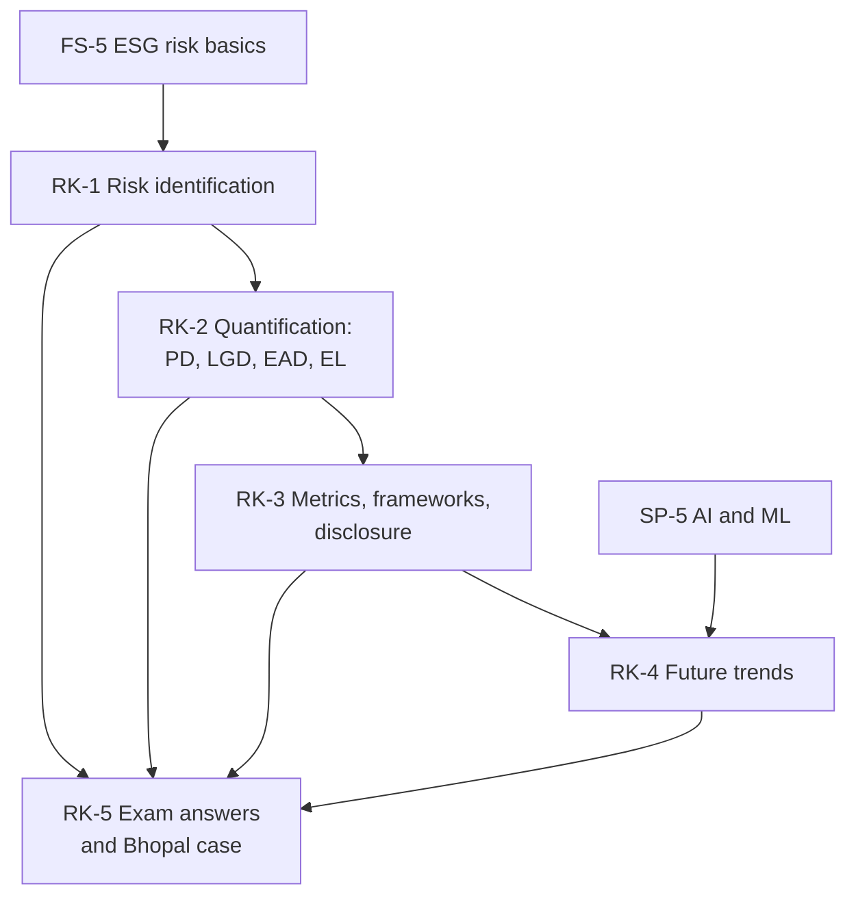

# Sustainable Finance Unit 4: Risk in Sustainable Finance, node map

ESE: 50 marks, 2 hours: 3 of 5 × 5, 2 of 3 × 10, one compulsory 15-mark case. Unit 4 is built from the faculty slides (single source of truth), with a Cambridge taxonomy lens added in RK-1. The course plan names the Bhopal gas tragedy case, built in RK-5. Examples are **illustrative** unless marked as class figures; items tagged [VERIFY] need a check.

## Nodes

| Node | Topic | Deps | Minutes | Exam focus |
|---|---|---|---|---|
| RK-1 | Risk Identification (market, credit, operational; register; workflow; Cambridge lens) | FS-5 | 42 | yes |
| RK-2 | ESG Risk Quantification (PD, LGD, EAD, expected loss, NBFC problem, scenarios, stress tests) | RK-1 | 45 | yes |
| RK-3 | Risk Metrics, Reporting Frameworks and Corporate Disclosure | RK-2 | 36 | yes |
| RK-4 | Future Trends in ESG Risk Management (AI, blockchain, emerging ESG analysis) | RK-3, SP-5 | 25 | no |
| RK-5 | Unit 4 Exam Answers (5, 10 and 15-mark layouts, Bhopal case) | RK-1 to RK-4 | 40 | yes |

Total reading time: about 188 minutes.

Nodes in this unit:
- [[Sustainable Finance Unit 4 - RK-1 Risk Identification]]
- [[Sustainable Finance Unit 4 - RK-2 ESG Risk Quantification]]
- [[Sustainable Finance Unit 4 - RK-3 Risk Metrics Reporting and Disclosure]]
- [[Sustainable Finance Unit 4 - RK-4 Future Trends in ESG Risk Management]]
- [[Sustainable Finance Unit 4 - RK-5 Unit 4 Exam Answers]]

## Dependency graph

## Headline numbers and facts to know

- Slide EL example: 0.02 × 0.40 × 1,000,000 = 8,000.
- NBFC cyclone problem: ₹2,000 crore × 18% = ₹360 crore exposed (EAD); collateral after 40% fall ₹216 crore; recovery 60%; LGD 40%; ECL at PD 15% = ₹21.6 crore; LTV 100% to 166.7% (board shows 166%).
- Carbon stress test (illustrative): interest cover 2.40, then 2.22 with carbon +30%, then 1.85 with a flood as well.
- Bhopal illustrative lender: EL ₹4.0 crore to ₹10.0 crore on ₹500 crore (+150%).
- Cambridge Taxonomy (2019): 6 classes, 37 families, 175 risk types; governance is the most under-recognised class.
- Workflow: Define, Identify, Assess, Quantify, Mitigate, Monitor. Good disclosure: accurate, relevant, comparable, consistent, transparent, verifiable.

## Links
- [[Sustainable Finance MOC]]
