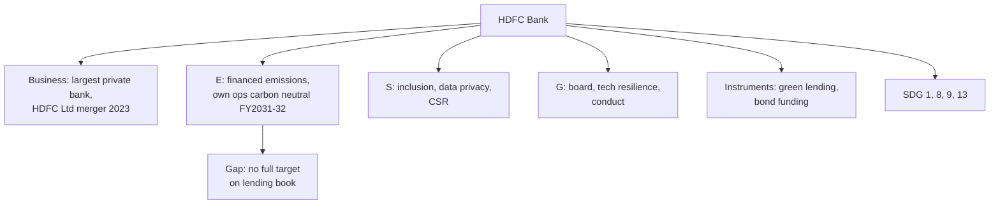

# CS-1 — HDFC Bank

Covers: the fixed case frame used for all five companies, applied to HDFC Bank, a bank whose ESG story is mostly about the loans it makes, not the buildings it runs. **(syllabus)** for the company choice; facts are **(general)**.

## How to use this node

Module 5 is "sustainable investment perspectives" of five listed companies, discussed from their own ESG or sustainability reports. The ESE has one compulsory 15-mark case. Every company node uses the same nine-part frame so you can compare them in CS-6:

1. Business and why ESG matters
2. Material E, S, G issues
3. Commitments and targets
4. Sustainable finance instruments
5. ESG ratings direction
6. Controversies and greenwashing risk
7. SDG mapping
8. Mini ESG risk matrix
9. Exam angle

**Figures rule.** Every number below is from memory, dated, and directional. Before the exam, check the latest BRSR and sustainability report. If you cannot recall a number, write the direction ("rising", "mostly achieved") and name the source. **[VERIFY]** marks anything I could not confirm.

## 1. Business and why ESG matters (general)

HDFC Bank is India's largest private-sector bank by assets. It merged with its parent HDFC Ltd in July 2023 **[VERIFY effective date]**, which made it one of the largest retail and housing lenders in the country.

For a bank, ESG risk sits in the **loan book and the customer base**, not in the branches. This is the idea of *financed emissions*: the emissions of borrowers count as the bank's indirect (Scope 3, category 15) emissions. A bank's own operations (offices, ATMs, data centres) are a small footprint compared with what its loans cause.

## 2. Material E, S and G issues (general)

| Pillar | Material issues |
|---|---|
| Environmental | Financed emissions and exposure to carbon-heavy borrowers; physical climate risk to collateral (floods, heat), especially housing; own energy use in branches and data centres |
| Social | Financial inclusion (rural and semi-urban reach, priority sector lending); customer data privacy and cyber security; fair selling and grievance handling; employee wellbeing and attrition; large CSR programmes |
| Governance | Board independence and RBI "fit and proper" norms; technology and outage risk management; conduct and mis-selling controls; management succession; related-party dealing after the HDFC Ltd merger |

## 3. Commitments and targets (general; verify in report)

- **Carbon neutral in its own operations by FY2031-32** (Scope 1 and 2 target). Treat the year as **[VERIFY]**, but this is the flagship commitment to quote.
- Renewable energy sourcing and energy efficiency in branches and data centres.
- Financial inclusion and CSR: very large annual CSR spend (check the latest figure in the Business Responsibility and Sustainability Report).
- Disclosure under **BRSR** (SEBI's mandatory format for top listed companies) with the core indicators.

Class point for the exam: a **bank's carbon neutral target for operations does not cover financed emissions**. Say this in one sentence; it is the best critical point available.

## 4. Sustainable finance instruments used (general)

- Green or sustainable financing lines for renewable energy, green buildings, and electric vehicles, offered to customers.
- Bond issuance: the bank has raised funds from labelled/infrastructure bond markets **[VERIFY whether any labelled green bond; do not claim a specific issue size]**.
- Role as an arranger and lender to green projects, and as a participant in the green deposit framework allowed by RBI **[VERIFY, RBI framework from 2023]**.

Write it this way in the exam: "HDFC Bank acts mainly as a **financier** of other firms' green projects. Its own labelled-bond usage is limited and should be verified."

## 5. ESG ratings direction (general)

Directionally stable to improving, with better scores on governance and social than on environment because of financed-emission disclosure gaps. Ratings are from providers such as MSCI, Sustainalytics, S&P Global CSA and CRISIL. **[VERIFY current scores]**. Note the usual point: ratings disagree because methods differ.

## 6. Controversies and greenwashing risk (general)

- **Technology outages and RBI restrictions (late 2020 to 2022):** RBI paused new digital launches and credit card issuance after repeated outages, then lifted the curbs **[VERIFY dates]**. This is an operational and governance lesson (tech risk is an ESG risk for a bank).
- **Mis-selling and conduct complaints**, common across banks.
- **Greenwashing risk:** moderate. The risk is not a false claim but a **narrow claim**: "carbon neutral by FY2031-32" covers operations while the lending book may still fund high-emission sectors. A reader should ask whether financed emissions are measured and given a target.

## 7. SDG mapping (general)

| SDG | Link |
|---|---|
| 1, 8 | Credit access, MSME and rural lending, jobs |
| 9 | Infrastructure and industry finance |
| 5 | Women's financial inclusion and diversity targets |
| 13 | Own carbon neutrality target and green financing |
| 11 | Housing finance (post-merger) |
| 16 | Governance, conduct and data protection |

Strongest: SDG 8 and 1 (inclusion). Weakest evidence: SDG 13 at portfolio level.

## 8. Mini ESG risk matrix (general; scale 1 low, 2 medium, 3 high unmanaged risk)

Scale as used in the student's CIA1 matrix. Scores are my judgment, not a rating.

| Indicator | Score | Why |
|---|---|---|
| Own operational emissions | 1 | Small footprint; target set |
| Financed emissions | 3 | Largest footprint; no full target known **[VERIFY]** |
| Data privacy and cyber | 2 | Huge customer base; rising threat |
| Financial inclusion | 1 | Core strength |
| Technology resilience | 2 | 2020 to 2022 outage history |
| Board and conduct | 1 to 2 | Strong board; conduct risk persists |

## Worked example: turning the frame into a 5-mark answer

**Question:** "Evaluate HDFC Bank's sustainability perspective." (5 marks)

1. Position (1 mark): Largest private bank; ESG risk is mainly in the loan book (financed emissions).
2. Commitments (1.5): Operational carbon neutrality by FY2031-32 target; renewable energy; large CSR; BRSR disclosure.
3. Instruments (1): Green lending lines; funding from bond markets; finance for renewable energy and housing.
4. Critique (1): Operational target excludes financed emissions; 2020 to 2022 tech-outage episode shows governance risk.
5. Decision line (0.5): "HDFC Bank's ESG case is **credible on social inclusion and governance, incomplete on climate**; the next step is a financed-emissions target by sector."

## Slide lens (class)

The faculty Unit 5 deck (slides 376-384) fixes the frameworks; the facts in this note only fill them in. The full slide frame and exam layouts are in CS-6.

| Slide framework | Applied to HDFC Bank |
|---|---|
| Perspective chain: Investment, financial return + ESG impact, risk management, resilience, long-term value | Lending and technology spend earn a return and also create financed emissions and inclusion impact. Risk management means climate and credit risk in the loan book. Resilience is technology uptime after the 2020-22 outages. Value is a stable, trusted franchise. |
| Risk metrics (slide 378) | Carbon footprint: own Scope 1-2 reported; the gap is Scope 3 category 15 (financed). Scenario analysis: heat and floods on housing collateral; check whether it is disclosed **[VERIFY]**. Financial linkage: credit risk (borrowers in high-emission sectors) and operational risk (technology). Transition planning: for a bank, the green share of new lending. |
| IFRS S1 / S2 lens | S1 test: do sustainability issues change cash flows, access to finance or cost of capital? For a bank, mostly through credit losses and funding. S2 pillars: Governance (board oversight), Strategy, Risk management, Metrics and targets. In India the mandated format today is BRSR; the slide says S1/S2 are widely adopted **[VERIFY status]**. |
| How ESG drives value (slide 383) | G (board, transparency) and S (inclusion, customer trust) are strongest; E is the weakest link. |

**Cambridge lens** (Cambridge Centre for Risk Studies, 2019; supplementary, never overrides the slides): Financial (credit crisis, credit-rating and counterparty risk in the loan book) and Technology (cyber, outages) lead. Environmental arrives through climate transition and physical risk to collateral. Governance (non-compliance, conduct, merger integration) is the class Cambridge found registers under-report.

## Exam angle

- Likely 5-mark: "How is ESG risk different for a bank than for a manufacturer?" (financed emissions, credit risk, reputation).
- Likely 10-mark: "Discuss HDFC Bank's ESG commitments and assess whether they are enough."
- In the 15-mark case, use HDFC Bank as the **financial-sector** example next to the industrial companies in CS-4 and CS-5.

## What to remember

- Bank ESG = loan book first, branches second (financed emissions, Scope 3 category 15).
- Flagship target: carbon neutral in operations by FY2031-32 **[VERIFY]**.
- Strengths: financial inclusion and governance. Gap: financed-emission target.
- 2020 to 2022 RBI tech curbs show technology risk is a governance risk.
- Always say "check the latest BRSR" when quoting any figure.

## Concept map

## Flashcards
Q: Why is a bank's ESG footprint mostly in its loan book?
A: Borrowers' emissions count as the bank's financed (Scope 3, category 15) emissions, which dwarf its own offices and branches.

Q: What is HDFC Bank's flagship climate target?
A: Carbon neutral in its own operations by FY2031-32 (check the latest report to confirm the year).

Q: What is the main limit of that target?
A: It covers the bank's operations only, not the emissions financed through its lending.

Q: Which SDGs fit HDFC Bank best?
A: SDG 8 and 1 (credit access, MSMEs, inclusion), plus 9, 5 and 13.

Q: Which episode shows technology risk as a governance issue for the bank?
A: The RBI curbs on digital launches and card issuance after outages in late 2020, lifted later (verify dates).

Q: What is the HDFC Ltd merger relevance to ESG?
A: It enlarged the retail and housing book, raising exposure to physical climate risk on collateral and to housing-related SDG 11.

Q: What is the safest wording on a company figure you cannot recall?
A: Give the direction and the source, for example "improving per the FY2024-25 BRSR; check the latest report".

Q: Give a one-line verdict on HDFC Bank's ESG case.
A: Credible on inclusion and governance, incomplete on climate until it sets a financed-emissions target.

## Sources
- BBA304F-5 course plan, Module 5 (company report case discussion)
- HDFC Bank BRSR and integrated annual report (check latest) **[VERIFY all figures]**
- RBI notices on digital launches (2020 to 2022) **[VERIFY]**
- [[Sustainable Finance Unit 5 - Corporate Cases MOC (Node Map)]]
- Next node: [[Sustainable Finance Unit 5 - CS-2 Infosys]]
