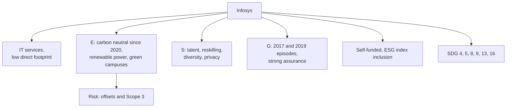

# CS-2 — Infosys

Covers: Infosys through the same nine-part frame as CS-1, with the offsets question (what "carbon neutral" really means) as the key critical point. Company choice **(syllabus)**; Infosys's sustainability report is named in the course plan references. Facts **(general)**. Check the latest BRSR before quoting numbers.

## 1. Business and why ESG matters (general)

Infosys is a Bengaluru-based global IT services and consulting company, among India's largest listed firms. It has no factories, so its **direct environmental footprint is low**. Its ESG risk sits in people (talent, attrition, ethics), governance (trust of clients and investors) and the **value chain** (purchased services, travel, employee commuting). The business runs on human capital and client trust, which is why S and G matter more than E.

## 2. Material E, S and G issues (general)

| Pillar | Material issues |
|---|---|
| Environmental | Electricity in campuses and data centres; business travel and commuting; Scope 3; water use on campuses; e-waste |
| Social | Talent attraction and attrition; reskilling; gender diversity in a workforce of several lakh people; employee wellbeing; data privacy for clients; community programmes through the Infosys Foundation |
| Governance | Board independence; founder-era disputes; whistleblower handling; tax and regulatory notices; audit quality and related-party dealings |

## 3. Commitments and targets (general; verify in report)

- **Carbon neutral since 2020** (FY2020 onwards, covering Scope 1, 2 and part of Scope 3). This is the headline to quote.
- A longer-term **net zero target** around 2040 and a goal of 100% renewable electricity **[VERIFY both the year and the scope; recent reports may have changed them]**.
- Energy efficient, green-certified campuses (IGBC or LEED type certifications **[VERIFY]**).
- Water-positive and zero-waste-to-landfill ambitions on campuses **[VERIFY]**.
- BRSR reporting with an independent assurance, plus GRI-style sustainability reporting **[VERIFY]**.

## 4. Sustainable finance instruments used (general)

No widely known green bond or sustainability-linked loan; Infosys is cash-rich and funds itself internally. Its sustainable finance link is therefore on the **investor side**: it is a constituent of ESG indices and ESG funds, which matter for cost of capital. Do not invent an instrument in the exam; say "internally funded; ESG shows up through index inclusion and investor demand".

## 5. ESG ratings direction (general)

Directionally **strong and stable**: regularly in the top tier of global IT-services peers on agencies such as S&P Global CSA, MSCI, Sustainalytics and CDP **[VERIFY current scores and any DJSI membership]**. The weakness is not rating level but whether neutrality claims rely on purchased offsets.

## 6. Controversies and greenwashing risk (general)

- **Governance episodes:** the 2017 board and founder disagreement over governance and executive pay that preceded the then-CEO's exit; the 2019 whistleblower complaints on accounting practices, which were investigated and not substantiated by the board's inquiry **[VERIFY wording and outcomes]**.
- **Tax notice:** a large GST demand notice in 2024 that was later withdrawn **[VERIFY amount and dates]**. Mention only as a regulatory-risk example.
- **Greenwashing angle:** "carbon neutral" is often reached by **renewable energy certificates and carbon credits**, not just by cutting emissions. A critical reader asks what share is reduced versus offset. This is a **claim-scope** risk, not evidence of false reporting.

## 7. SDG mapping (general)

| SDG | Link |
|---|---|
| 4 | Digital skilling, reskilling, scholarships |
| 8 | Large formal employment, fair workplace |
| 9 | Technology and innovation services |
| 5 | Women in workforce and leadership |
| 13 | Carbon neutrality, renewable energy |
| 16 | Ethics, governance, anti-corruption |

Strongest: SDG 4 and 8. Less evidence: SDG 13 beyond Scope 1 and 2.

## 8. Mini ESG risk matrix (general; 1 low, 2 medium, 3 high unmanaged risk)

| Indicator | Score | Why |
|---|---|---|
| Operational emissions | 1 | Low base; renewable power; neutrality claim |
| Value chain (Scope 3) and offsets reliance | 2 | Travel, purchased services; offsets quality |
| Talent and attrition | 2 | People are the product; cyclical attrition |
| Diversity | 2 | Progress but senior gap persists |
| Data privacy and cyber | 2 | Client data, large attack surface |
| Governance and ethics | 2 | Past disputes; strong processes today |

## Worked example: a 10-mark skeleton

**Question:** "Is Infosys's carbon neutrality claim a sufficient sign of sustainability leadership?" (10 marks)

1. Define the claim (1): carbon neutral since 2020, covering Scope 1 and 2 and some of Scope 3.
2. Evidence for (3): low-footprint business; renewable power; green campuses; strong disclosure and assurance; strong ratings.
3. Evidence against (3): neutrality can use offsets; Scope 3 depends on suppliers and travel; most material issues for an IT firm are people and governance.
4. Governance record (1): 2017 and 2019 episodes show why G is the key pillar.
5. Decision line (2): "Neutrality is **a necessary but not a sufficient** sign. Infosys leads among Indian IT peers on disclosure, but the offsets share and a Scope 3 target decide whether the claim is genuine."

## Slide lens (class)

The faculty Unit 5 deck (slides 376-384) fixes the frameworks; the facts in this note only fill them in. The full slide frame and exam layouts are in CS-6.

| Slide framework | Applied to Infosys |
|---|---|
| Perspective chain | Investment in campuses, renewable power and reskilling earns a return and builds ESG impact. Risk management covers talent, privacy and governance. Resilience is client trust and low attrition. Value is steady, high-quality earnings. |
| Risk metrics (slide 378) | Carbon footprint: Scope 1-2 are small; Scope 3 (travel, purchased services) and offsets are the test. Scenario analysis: heat and flood risk to campuses, low financial impact **[VERIFY disclosure]**. ESG quantification: social metrics (attrition, diversity) matter most. Transition planning: renewable power and net zero year **[VERIFY]**. |
| IFRS S1 / S2 lens | S1: talent and trust issues affect cash flows through client retention and cost of capital through governance perception. S2 pillars: strong board oversight and assured BRSR; check Scope 3 and the offset share under Metrics and targets. |
| How ESG drives value (slide 383) | Social (people, diversity) and Governance (transparency, ethics) carry the value; Environmental is mostly cost and brand. |

**Cambridge lens** (Cambridge Centre for Risk Studies, 2019; supplementary): Social (human capital: attracting talent, loss of key personnel) and Governance (corruption and fraud, litigation, non-compliance such as tax notices) lead, with Technology (cyber, AI as disruptive technology) alongside. Geopolitical enters through talent availability and regulation in client countries. Environmental is the smallest class here.

## Exam angle

- Likely 5-mark: "Explain carbon neutral vs net zero, with Infosys as an example." (neutral = balance with offsets allowed; net zero = deep cuts of at least 90% with only residual offset, per SBTi **[VERIFY]**).
- Likely 10-mark: "Why does governance matter most for a services company?"
- In the 15-mark case, Infosys is your **low-carbon, people-driven** example against JSW Steel and Vedanta.

## What to remember

- Infosys is a low-footprint services firm; S and G matter more than E.
- Headline: carbon neutral since 2020 (verify scope and the net zero year).
- Risk: neutrality via offsets; Scope 3 and travel; trust and governance.
- Not a known issuer of green bonds; self-funded.
- Verdict wording: "necessary, not sufficient".

## Concept map

## Flashcards
Q: Why do S and G matter more than E for Infosys?
A: It has no heavy plants; its value comes from people and client trust, so talent, data privacy and governance are the main risks.

Q: What is Infosys's headline climate claim?
A: Carbon neutral since 2020 (check the latest report for scope and any net zero year).

Q: What is the greenwashing question on that claim?
A: How much of the neutrality comes from real cuts and how much from offsets or certificates.

Q: Difference between carbon neutral and net zero?
A: Carbon neutral balances emissions with removals or offsets; net zero requires deep cuts across the value chain with only a small residual offset.

Q: Has Infosys relied on green bonds for funding?
A: Not as far as widely known; it is cash-rich and self-funded. Its ESG link to capital markets is through ESG indices and investor demand.

Q: Name one governance episode that shaped Infosys's ESG story.
A: The 2017 founder and board dispute over governance and pay, or the 2019 whistleblower complaints (verify details).

Q: Which SDGs fit Infosys best?
A: SDG 4 (skilling) and 8 (decent work), then 9, 5, 13 and 16.

Q: One-line verdict?
A: Strong on disclosure and people; the climate claim is necessary but not sufficient until offsets and Scope 3 are shown.

## Sources
- BBA304F-5 course plan, Module 5 and references (Infosys sustainability report)
- Infosys BRSR and sustainability report (check latest) **[VERIFY all figures]**
- [[Sustainable Finance Unit 5 - Corporate Cases MOC (Node Map)]]
- Next node: [[Sustainable Finance Unit 5 - CS-3 ITC]]
