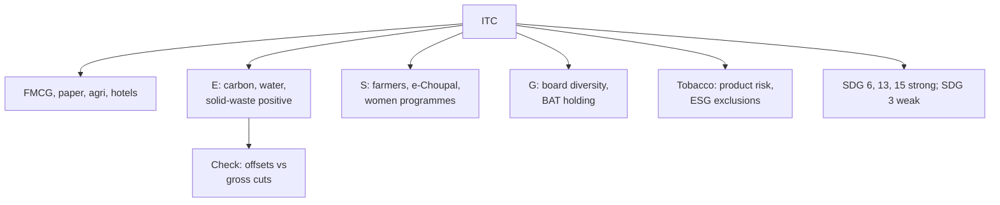

# CS-3 — ITC

Covers: ITC through the nine-part frame, with the "positive" claims (carbon, water, solid waste) and the tobacco question as the two sides of the case. Company choice **(syllabus)**; the ITC peer row is from **(student CIA1)**; the rest **(general)**. Check the latest ITC sustainability report and BRSR before quoting numbers.

## 1. Business and why ESG matters

ITC is a diversified Indian conglomerate. Its segments are **FMCG (cigarettes and other FMCG), paperboards and packaging, agri business, and hotels** (hotels were demerged into a separately listed company in early 2025 **[VERIFY]**). Cigarettes still supply a large share of profit.

ESG matters in an unusual way. ITC runs resource-heavy businesses (paper mills, agri sourcing, hotels) and a product (tobacco) that many ESG funds exclude. So it has strong **operational** stories and a permanent **product** problem.

## 2. Material E, S and G issues

| Pillar | Material issues |
|---|---|
| Environmental | Energy and carbon in paper and packaging; water use; solid waste and plastic packaging (EPR); wood and farm sourcing; afforestation; biodiversity |
| Social | Farmer livelihoods (e-Choupal, agri extension); women's empowerment; health harm from tobacco; employee and contractor safety; community programmes |
| Governance | Large foreign shareholder (BAT) and promoter-less structure; board composition and women directors; related-party transactions; tobacco regulation and tax exposure |

## 3. Commitments and targets

- **Carbon positive** for about two decades, **water positive** for over two decades, and **solid-waste recycling positive** for many years. Student CIA1 recorded "carbon positive 20 years, water positive 23 years" **(student CIA1; check the latest report for the current count)**.
- **Net zero**: the student's CIA1 peer table records a **2039 full value chain (Scope 1 to 3)** goal for ITC **(student CIA1) [VERIFY year and scope against the latest ITC report]**.
- Large-scale afforestation and watershed work in rural areas; renewable energy share is high in its paper and hotels operations.
- Disclosure: sustainability report, ESG fact book, nature-related report and BRSR (student's note).

## 4. Sustainable finance instruments used

None widely known as a labelled green bond or sustainability-linked loan; ITC has strong internal cash flows and low debt. Its sustainable finance links are **investor-side** (included in sustainability indices; held by ESG funds with exclusion screens that sometimes block it). In the exam say: "Internally funded; green capital markets are not its main channel." **[VERIFY]**

## 5. ESG ratings direction

The student's CIA1 table shows an **S&P Global CSA score of about 81** for ITC, among the strongest in its peer set **(student CIA1; check year)**. Direction: strong on operations, with a ceiling because of the tobacco exposure, which many agencies treat as a **controversial product** category.

## 6. Controversies and greenwashing risk

- **Tobacco:** health harm is the biggest ESG issue. No amount of carbon or water positivity offsets it, because the harm is in the product.
- **"Positive" claims are not like-for-like.** The student's CIA1 notes that "offset style 'positive' claims" are **less comparable** than direct emission and intensity cuts. A positive claim can come from afforestation credits and water harvesting beyond own use, while gross emissions may not fall. Ask for gross emissions and intensity too.
- **Board diversity:** the student's CIA1 records about 6% women on a roughly 16-member board with one identified woman director and an exit **(student CIA1; verify the latest board)**.
- **Packaging and plastics:** FMCG packaging exposure under EPR rules.

## 7. SDG mapping

| SDG | Link |
|---|---|
| 13, 15 | Carbon positive, afforestation, biodiversity |
| 6 | Water positive, watershed development |
| 1, 2, 8 | Farmer income, e-Choupal, rural livelihoods |
| 5 | Women's empowerment programmes |
| 12 | Waste recycling, circular packaging |
| 3 | **Conspicuously weak**: tobacco |

Strongest: SDG 6, 13, 15. The honest "most ignored" SDG is **3 (health)**, the same logic the student used for HUL.

## 8. Mini ESG risk matrix (1 low, 2 medium, 3 high unmanaged risk)

| Indicator | Score | Why |
|---|---|---|
| Operational emissions and water | 1 | Strong programmes and long track record |
| Value chain emissions | 2 | Agri and wood sourcing; target exists |
| Product health (tobacco) | 3 | Structural; no mitigation inside the product |
| Board diversity | 2 to 3 | Low women representation per CIA1 |
| Regulatory and tax exposure | 2 | Tobacco taxation and rules |
| Disclosure quality | 1 | Multiple reports and BRSR |

## Worked example: 15-mark style structure on ITC

**Question:** "ITC claims to be carbon, water and solid-waste positive. Critically evaluate its sustainability perspective." (15 marks)

1. Company and context (2): diversified FMCG, paper, agri, hotels; tobacco still central to profit.
2. Claims and targets (3): carbon positive about two decades; water positive over two decades; solid-waste positive; net zero ambition (verify 2039).
3. Evidence quality (3): positive claims rely on sequestration and offset-style gains; gross emission and intensity data matter; compare with HUL operational decarbonisation and Nestle India intensity cuts from the student's CIA1.
4. The tobacco problem (3): product harm sits outside E and carbon; ESG funds apply exclusions; SDG 3 is the ignored goal.
5. Social and governance (2): farmer livelihoods strong; women on board low.
6. Decision line (2): "ITC has the **strongest environmental positioning on paper**, but the **tobacco core and offset-style claims** make it less comparable than direct intensity reductions. Verdict: strong operational ESG, structural product risk."

## Slide lens (class)

The faculty Unit 5 deck (slides 376-384) fixes the frameworks; the facts in this note only fill them in. The full slide frame and exam layouts are in CS-6.

| Slide framework | Applied to ITC |
|---|---|
| Perspective chain | Investment in paper, agri and FMCG earns a return; ESG impact is carbon, water and farmer outcomes. Risk management is the tobacco exposure and sourcing. Resilience is diversification away from cigarettes. Value depends on how far non-tobacco profit grows. |
| Risk metrics (slide 378) | Carbon footprint: 'positive' claims need gross Scope 1-3 and intensity beside them. Scenario analysis: water and heat for agri and paper **[VERIFY disclosure]**. Financial linkage: regulatory and tax risk on tobacco hits cash flow directly. Transition planning: net zero 2039 target per the student's CIA1 **[VERIFY]**. |
| IFRS S1 / S2 lens | S1: tobacco regulation and ESG fund exclusions affect cash flows and cost of capital, a clear financial-materiality case. S2: Scope 1-3 disclosure and the net zero plan are the checks; ITC publishes several reports plus BRSR. |
| How ESG drives value (slide 383) | Environmental stewardship and Social (farmers) build value; Governance (board diversity) and the product limit it. |

**Cambridge lens** (Cambridge Centre for Risk Studies, 2019; supplementary): Social (health trends, consumer activism) and Geopolitical (government policy, emerging regulation and taxation of tobacco) lead the product risk. Environmental (water, waste and pollution, deforestation) is the managed side. Governance (litigation, board composition) completes the picture.

## Exam angle

- Likely 5-mark: "What does 'carbon positive' mean and what is its limit?" (sequesters more than it emits; may use removals and offsets; check gross cuts).
- Likely 10-mark: "Can a company with a tobacco business be a sustainability leader?"
- Link to CS-6: ITC is the **"strong operations, weak product"** corner of the comparison table.

## What to remember

- ITC: FMCG, paper, agri, hotels (demerged 2025, verify); tobacco still key.
- Claims: carbon, water and solid-waste positive for two decades or so (check latest).
- Student CIA1: CSA about 81; net zero 2039 (verify); about 6% women on the board.
- Limit: "positive" claims are less comparable than gross intensity cuts; tobacco is a product-level ESG issue.
- Ignored SDG: 3.

## Concept map

## Flashcards
Q: What are ITC's three "positive" claims?
A: Carbon positive, water positive and solid-waste recycling positive, each held for roughly two decades or longer (check the latest report).

Q: Why are "positive" claims harder to compare with intensity cuts?
A: They can rest on afforestation and offset-style gains while gross emissions may not fall; intensity cuts show actual operational improvement.

Q: What is ITC's biggest structural ESG issue?
A: Tobacco, a product-level harm that carbon and water programmes cannot offset.

Q: Which SDG is ITC's most ignored?
A: SDG 3 (good health and well-being), because of tobacco.

Q: What did the student's CIA1 record for ITC's rating?
A: S&P Global CSA of about 81, among the strongest in the peer set (check the year).

Q: What did the student's CIA1 record on ITC board diversity?
A: About 6% women on a roughly 16-member board, with one identified woman director (verify the latest board).

Q: Which businesses sit in ITC today?
A: FMCG, paperboards and packaging, agri business, with hotels demerged and separately listed in early 2025 (verify).

Q: One-line verdict on ITC?
A: Strongest environmental positioning on paper; the tobacco core and offset-style claims limit how far that counts.

## Sources
- BBA304F-5 course plan, Module 5 and references (ITC sustainability report)
- Student CIA1 HUL profile, peer benchmarking table (HUL, ITC, Nestle India)
- ITC sustainability report, ESG fact book and BRSR (check latest) **[VERIFY all figures]**
- [[Sustainable Finance Unit 5 - Corporate Cases MOC (Node Map)]]
- Next node: [[Sustainable Finance Unit 5 - CS-4 JSW Steel]]
