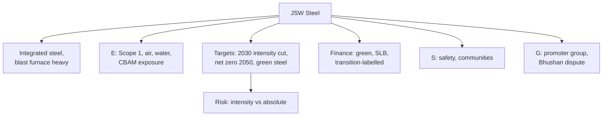

# CS-4 — JSW Steel

Covers: JSW Steel through the nine-part frame, as the **hard-to-abate sector** and transition-finance example. Company choice **(syllabus)**; facts **(general)**. JSW Steel is not among the reports named in the course plan references, so read its latest sustainability report and BRSR if you have time.

## 1. Business and why ESG matters (general)

JSW Steel is one of India's largest steel producers, part of the JSW Group, with large integrated plants (for example Vijayanagar in Karnataka and Dolvi in Maharashtra **[VERIFY]**). Steel made by the blast furnace route is among the **most carbon-intensive** industrial products. Steel making is a large share of global CO₂ emissions (commonly quoted at around 7 to 8% **[VERIFY]**), and India's steel demand is growing fast.

So ESG is not an add-on. **Transition risk** (carbon prices, border carbon taxes such as the EU CBAM, buyer demand for low-carbon steel) can decide the firm's future profits.

## 2. Material E, S and G issues (general)

| Pillar | Material issues |
|---|---|
| Environmental | Scope 1 process emissions; coal and coke dependence; air pollution (particulates, SOx); water; slag and solid waste; mining linkages; energy transition |
| Social | Worker safety (hot metal, heavy machinery); contract labour; community effects near plants; land and rehabilitation |
| Governance | Promoter-led group; related-party transactions; acquisition-linked legal risk; transparency of target setting |

## 3. Commitments and targets (general; verify in report)

- **Emission-intensity targets for 2030**: JSW Steel has committed to reduce the CO₂ per tonne of crude steel by a stated percentage by 2030 against a base year **[VERIFY exact % and base year; do not quote a number from memory]**. Note "intensity" targets allow absolute emissions to rise if output grows.
- **Net zero by 2050** is the long-term ambition quoted for the company **[VERIFY]**.
- **Green steel**: moving towards lower-carbon routes (electric arc furnace with scrap, renewable power, green hydrogen pilots, direct reduced iron with gas) and a branded green steel product line **[VERIFY product name and tonnage]**.
- Renewable power procurement, waste heat recovery, slag utilisation.

## 4. Sustainable finance instruments used (general)

JSW Group companies have raised **green and transition-linked financing** in international bond and loan markets; JSW Steel has used sustainability-linked or green-labelled instruments **[VERIFY exact instrument, year and size; do not quote an amount]**. This is the textbook case for **sustainability-linked bonds (SLBs)** and **transition bonds** for hard-to-abate sectors (see Unit 3). The key exam questions on such instruments:

1. Is the KPI **material** (CO₂ intensity per tonne crude steel)?
2. Is the target **ambitious** against a science-based pathway, and is it dated before the bond matures?
3. Is the step-up **large enough** to hurt?

## 5. ESG ratings direction (general)

Directionally **improving but constrained by sector**: steel makers score lower than software or FMCG firms on most agencies, so the fair comparison is **against steel peers** (for example other Indian integrated steel companies and global producers) **[VERIFY scores]**. Say "improving versus its own past, mid-pack against global steel peers".

## 6. Controversies and greenwashing risk (general)

- **Bhushan Power and Steel acquisition (via insolvency):** litigation and enforcement-agency actions went to the Supreme Court, with significant legal uncertainty over the resolution plan in 2025 **[VERIFY latest status; mention only as a governance and legal-risk example]**.
- **Local pollution and community complaints** near large steel plants are a recurring risk in the sector.
- **Greenwashing risk (moderate to high):** "green steel" can be a small share of output while the large majority is still produced in blast furnaces. An **intensity target** can be met while **absolute emissions rise**. Ask for tonnes of green steel as a share of total, and absolute Scope 1 trend.

## 7. SDG mapping (general)

| SDG | Link |
|---|---|
| 9 | Industry, infrastructure, innovation (steel and low-carbon technology) |
| 13 | Emission-intensity targets, green steel, net zero |
| 12 | Slag use, resource efficiency |
| 7 | Renewable power procurement |
| 8 | Large direct and indirect employment; safety |
| 3, 11 | Air quality near plants: **weak link** |

Strongest: SDG 9 and 13 as aims. Weakest evidence: SDG 3 and 11 (local air quality).

## 8. Mini ESG risk matrix (1 low, 2 medium, 3 high unmanaged risk)

| Indicator | Score | Why |
|---|---|---|
| Scope 1 process emissions | 3 | Blast furnace route dominates |
| Carbon border and market risk | 3 | CBAM and buyer demands |
| Local air pollution | 2 to 3 | Large integrated plants |
| Worker safety | 2 | Heavy industry hazards |
| Governance and legal | 2 | Acquisition-linked disputes |
| Disclosure and targets | 2 | Targets exist; absolute path needs checking |

## Worked example: SLB test for a steel company

**Question:** "A steel company issues an SLB with a KPI of CO₂ per tonne of crude steel. Is it credible?" (10 marks)

Using the same 25 bps step-up convention as the Bond Market FB-1 worked example. Illustration only, not JSW Steel's terms.

1. Illustrative issue: ₹1,000 crore, 5 years, 25 bps step-up from year 4 if the target is missed at end of year 3.
2. Penalty if missed = 0.25% × ₹1,000 crore = **₹2.5 crore a year**, for years 4 and 5 = **₹5 crore** in total.
3. Compare: ₹5 crore against a ₹1,000 crore issue is **0.5% of principal over the life**: small.
4. Credibility test: KPI is material (yes); target dated before maturity (yes, year 3); step-up size (weak); intensity not absolute (weak).
5. **Decision line:** "The instrument is **credible in design but weak in penalty**; investors should insist on absolute-emission reporting and a larger step-up. For a hard-to-abate sector, a transition-labelled instrument is the honest label."

## Slide lens (class)

The faculty Unit 5 deck (slides 376-384) fixes the frameworks; the facts in this note only fill them in. The full slide frame and exam layouts are in CS-6.

| Slide framework | Applied to JSW Steel |
|---|---|
| Perspective chain | Capex in new capacity and in lower-carbon routes earns a return; ESG impact is emissions per tonne. Risk management is carbon price and CBAM exposure. Resilience is the green steel share and access to transition finance. Value is a plant base that still sells in a low-carbon market. |
| Risk metrics (slide 378) | Carbon footprint: Scope 1 dominates; ask for absolute as well as intensity. Scenario analysis: resilience under 1.5C, 2C and higher pathways is the key disclosure for steel **[VERIFY]**. Financial linkage: carbon pricing and border taxes change costs and market access. Transition planning: capex alignment with the 2050 net zero goal is the central slide metric. |
| IFRS S1 / S2 lens | S1: access to finance and cost of capital depend on credible transition plans. S2: physical and transition risks, scenario analysis, Scope 1-3 and transition-plan capex all apply directly. This is the best fit to S2 among the five companies. |
| How ESG drives value (slide 383) | Environmental stewardship (energy, water, waste) cuts cost and future-proofs operations; social (safety) and governance (target transparency) support it. |

**Cambridge lens** (Cambridge Centre for Risk Studies, 2019; supplementary): Environmental (climate change transition, waste and pollution) leads. Financial (commodity price fluctuation, tariff dispute) and Geopolitical (emerging regulation, protectionism such as CBAM) transmit it. Technology (industrial accident: fire, explosion; disruptive low-carbon technology) and Governance (litigation, M&A) are secondary.

## Exam angle

- Likely 5-mark: "Why is steel a hard-to-abate sector, and what is green steel?"
- Likely 10-mark: "Explain how sustainability-linked finance supports a steel producer's decarbonisation, and its limits."
- In the 15-mark case, JSW Steel is the **high carbon-intensity, high transition-finance** corner against Infosys (low carbon).

## What to remember

- Blast furnace steel is among the most carbon-intensive products; transition risk is financial risk.
- Targets: 2030 intensity cut (verify %), net zero 2050 (verify), green steel route.
- Intensity targets can hide rising absolute emissions.
- Instrument logic: SLB or transition bond with a material KPI; check step-up size.
- Controversy to name: Bhushan Power acquisition legal dispute (verify), local pollution.

## Concept map

## Flashcards
Q: Why is ESG transition risk financial for a steel maker?
A: Carbon prices, border carbon taxes (EU CBAM) and low-carbon buyer demand can change costs and market access.

Q: What is the difference between an intensity and an absolute target?
A: Intensity is emissions per tonne of output and can fall while total emissions rise with growth; absolute is the total.

Q: What is green steel?
A: Steel produced with a much lower carbon route, such as scrap-based electric arc furnaces, renewable power or hydrogen-based reduction.

Q: Which instruments fit a hard-to-abate sector?
A: Sustainability-linked bonds and transition bonds, tied to a KPI such as CO₂ per tonne of crude steel.

Q: Illustrative SLB: ₹1,000 crore, 25 bps step-up for years 4 and 5. Extra cost if the target is missed?
A: 0.25% × ₹1,000 crore = ₹2.5 crore a year, ₹5 crore over two years.

Q: What is the main greenwashing question on "green steel"?
A: What share of total output it is, and whether absolute emissions are falling.

Q: Which SDGs does JSW Steel claim and which is weak?
A: SDG 9 and 13 as aims, 7 and 12 supporting; weak evidence on SDG 3 and 11 (local air quality).

Q: What is JSW Steel's long-term climate ambition?
A: Net zero by 2050 along with a 2030 emission-intensity target (verify the exact figures in the latest report).

## Sources
- BBA304F-5 course plan, Module 5 (JSW Steel named)
- JSW Steel sustainability report and BRSR (check latest) **[VERIFY all figures and instruments]**
- ICMA Sustainability-Linked Bond Principles; Bond Market FB-1 for the step-up convention
- [[Sustainable Finance Unit 5 - Corporate Cases MOC (Node Map)]]
- Next node: [[Sustainable Finance Unit 5 - CS-5 Vedanta]]
