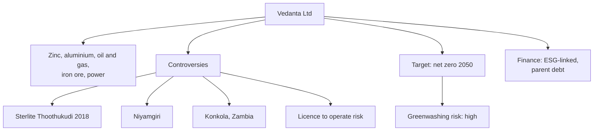

# CS-5 — Vedanta Ltd

Covers: Vedanta through the nine-part frame, as the **controversy and licence-to-operate** case. Company choice **(syllabus)**; Vedanta's sustainability report is named in the course plan references. Facts **(general)**. Controversy facts below are public record but dates and counts must be checked.

## 1. Business and why ESG matters (general)

Vedanta Ltd is a diversified natural resources company: **zinc (through Hindustan Zinc), aluminium, oil and gas, iron ore, power, and copper (historically)**. It is controlled by the Vedanta Resources group (UK-listed parent until it was delisted in 2020 **[VERIFY]**). A demerger into separate businesses has been proposed and progressed **[VERIFY status]**.

Mining and metals are the most contested ESG sector: they need **land, water, forest and community consent** (a social licence to operate), and their emissions are high. For Vedanta, ESG risk has directly closed plants and blocked mines.

## 2. Material E, S and G issues (general)

| Pillar | Material issues |
|---|---|
| Environmental | Scope 1 and 2 from smelters and power; water stress; tailings and waste; air and groundwater pollution; biodiversity and forest land |
| Social | Community consent (especially tribal land rights); health impacts; worker safety and contractor deaths; land acquisition; livelihoods |
| Governance | Promoter-controlled, high debt at parent; related-party and group dividends or brand fees; litigation record; credibility of disclosures |

## 3. Commitments and targets (general; verify in report)

- **Net zero by 2050** (company-announced, covering Scope 1 and 2 and **Scope 3 where stated [VERIFY]**).
- Interim goals on renewable power procurement, water recycling and a "water positive" ambition, and emission-intensity cuts by 2030 **[VERIFY percentages and base year]**.
- Biodiversity, tailings management and community programmes reported in its sustainability report.

## 4. Sustainable finance instruments used (general)

Vedanta group has sought **green, sustainability-linked or transition-type financing**, and aims to link borrowing to ESG KPIs **[VERIFY any specific bond or loan]**. Debt stress at the parent matters more than the label: investors ask whether an SLB can change behaviour at a **highly leveraged, controversy-prone issuer**. Say: "labelled finance helps only if the KPI is material and independently verified; the credibility starts with the track record".

## 5. ESG ratings direction (general)

Ratings are **mixed and divergent**: some agencies give improved scores for disclosure and targets, while others rate the company higher risk because of controversy history and the sector **[VERIFY current scores]**. Some large investors have in the past **excluded** Vedanta group entities on ethical grounds (for example the Norwegian government pension fund's exclusion in 2007 for environmental and human rights concerns, and certain church investors **[VERIFY details]**). Use this as an example of **exclusion screening in practice** (Unit 1 and 3).

## 6. Controversies and greenwashing risk (general)

Name these three, with dates marked [VERIFY]:

1. **Sterlite Copper, Thoothukudi (Tamil Nadu), 2018.** Protests against the copper smelter over pollution ended in police firing in May 2018 that killed 13 people. The state ordered closure; the plant has stayed shut after court challenges (the Supreme Court did not allow reopening in 2021) **[VERIFY year and outcome]**.
2. **Niyamgiri (Odisha).** A bauxite mining project in hills sacred to the Dongria Kondh. The Supreme Court in 2013 asked that tribal village councils (gram sabhas) decide; they rejected the mine **[VERIFY]**. The lesson is **free, prior and informed consent**.
3. **Konkola Copper Mines, Zambia.** Villagers' pollution claims against the UK parent were allowed to proceed in English courts (UK Supreme Court, 2019) **[VERIFY]**, and later settled **[VERIFY]**.

Also: the 2009 BALCO chimney collapse that killed many workers **[VERIFY count]**.

**Greenwashing risk: high.** Net zero 2050 is far away; the track record on community consent is poor; check for interim targets and independent assurance. In the student's CIA1 language, this is a case where the **"promise versus actual outcome" gap** is partly historical (trust deficit) and partly forward-looking (target credibility).

## 7. SDG mapping (general)

| SDG | Link |
|---|---|
| 9 | Metals and minerals for infrastructure |
| 7, 13 | Renewable power and net zero ambition |
| 8 | Employment, but with safety incidents |
| 6, 15 | **Conflict**: water stress, forest and biodiversity |
| 3 | **Conflict**: pollution and health in communities |
| 16 | Governance, justice, rights: weak historical record |

Strongest: SDG 9. Conflicted: SDG 6, 15, 3, 16.

## 8. Mini ESG risk matrix (1 low, 2 medium, 3 high unmanaged risk)

| Indicator | Score | Why |
|---|---|---|
| Operational emissions | 3 | Smelters and captive power |
| Water and pollution | 3 | Local stress and past incidents |
| Community consent and land rights | 3 | Niyamgiri, Thoothukudi |
| Worker safety | 3 | Mining and smelting hazards; past fatal incidents |
| Governance and leverage | 3 | Promoter control; parent debt |
| Disclosure and targets | 2 | Reports exist; credibility lag |

## Worked example: case answer on Sterlite Thoothukudi (10 marks)

**Question:** "Using Sterlite Thoothukudi 2018 as an example, explain how social and governance failures become financial risk." (10 marks)

1. Event (2): protests over pollution at the copper smelter; police firing in May 2018 killed 13; closure order followed.
2. Channel 1, **regulatory** (2): consent to operate withdrawn, plant closed.
3. Channel 2, **operational** (2): production lost, assets stranded; litigation cost.
4. Channel 3, **reputation and capital** (2): investor exclusion, higher cost of capital, brand damage across the group.
5. **Decision line** (2): "The closure shows that **S and G risk converts into E and financial loss through the licence to operate**. An ESG-risk-aware lender prices this before the event: community consent, pollution record and grievance systems are leading indicators."

## Slide lens (class)

The faculty Unit 5 deck (slides 376-384) fixes the frameworks; the facts in this note only fill them in. The full slide frame and exam layouts are in CS-6.

| Slide framework | Applied to Vedanta |
|---|---|
| Perspective chain | Investment in mines and smelters earns a return but depends on land, water and consent. ESG impact is large and contested. Risk management must cover licence to operate. Resilience is the ability to keep plants open. Value is at risk until trust is rebuilt. |
| Risk metrics (slide 378) | Carbon footprint: heavy Scope 1-2 from smelters and captive power. ESG quantification: community, pollution and safety metrics matter as much as carbon. Financial linkage: closure, litigation and cost of capital (Sterlite 2018). Transition planning: net zero 2050 is far-dated; look for interim capex milestones. |
| IFRS S1 / S2 lens | S1: the Sterlite closure shows S and G risks reaching cash flows and access to finance, so they are financially material. S2: scenario analysis, Scope 1-3 and a dated transition plan are the tests of credibility; slide 382 warns that missed targets become reputational risk. |
| How ESG drives value (slide 383) | Social responsibility and governance transparency are the weak links that decide whether environmental targets are believed. |

**Cambridge lens** (Cambridge Centre for Risk Studies, 2019; supplementary): the one company that touches all six classes. Geopolitical (licence revocation, social unrest) and Social (brand perception, community) drove the 2018 closure. Environmental (pollution, water, biodiversity), Governance (litigation, safety non-compliance, negligence), Financial (credit-rating downgrade, commodity price) and Technology (industrial accident: structural failure) follow.

## Exam angle

- Likely 5-mark: "What was the Niyamgiri case and what does it teach?" (consent of tribal communities; social licence).
- Likely 10-mark: "Critically assess Vedanta's net zero 2050 target in light of its controversy record."
- In the 15-mark case, Vedanta is the **high-controversy, high-greenwashing-risk** corner.

## What to remember

- Mining and metals: social licence to operate decides the business.
- Controversies: Sterlite Thoothukudi 2018 (13 killed, closure), Niyamgiri (gram sabha rejected the mine), Konkola in Zambia.
- Target: net zero 2050 (verify scope); far-dated, so ask for interim milestones.
- Rating pattern: disclosure improving, controversy keeps risk scores high; some investors exclude.
- Link: S and G failure becomes financial loss through regulation, operations and capital.

## Concept map

## Flashcards
Q: What happened at Sterlite Copper, Thoothukudi in 2018?
A: Protests over pollution at the copper smelter ended in police firing in May 2018 that killed 13 people; the state ordered the plant closed (verify details).

Q: What is the Niyamgiri lesson?
A: Tribal communities' consent (gram sabha decision) is required for mining on sacred land; social licence to operate matters.

Q: What is Vedanta's long-term climate target?
A: Net zero by 2050 (check scope and interim milestones in the latest report).

Q: How does an S or G failure become a financial loss?
A: Through regulatory closure, lost production and litigation, and higher cost of capital or investor exclusion.

Q: Name an investor-side action against Vedanta group entities.
A: Exclusion by some large investors, for example Norway's government pension fund in 2007 (verify).

Q: Why is greenwashing risk high for Vedanta?
A: Net zero is far-dated, and the history of community and pollution disputes weakens trust in claims.

Q: What would make an ESG-linked loan to Vedanta credible?
A: A material KPI, independent verification, a meaningful price step-up and interim milestones before the maturity.

Q: Which SDGs conflict with Vedanta's activities?
A: SDG 6 (water), 15 (land and biodiversity), 3 (health) and 16 (justice and rights).

## Sources
- BBA304F-5 course plan, Module 5 and references (Vedanta sustainability report)
- Vedanta sustainability report and BRSR (check latest) **[VERIFY all figures, dates and counts]**
- Court and news records of Sterlite Thoothukudi (2018), Niyamgiri (2013), Konkola (UK Supreme Court 2019) **[VERIFY]**
- [[Sustainable Finance Unit 5 - Corporate Cases MOC (Node Map)]]
- Next node: [[Sustainable Finance Unit 5 - CS-6 Exam Answers and the Case Method]]
