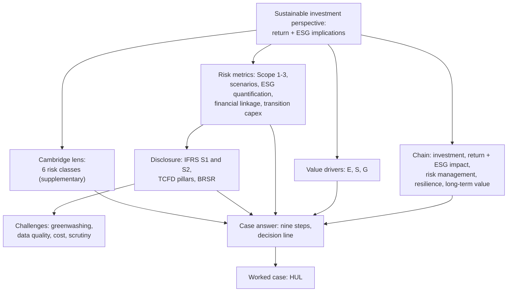

# CS-6 — Unit 5 Exam Answers and the Case Method

Covers: the faculty "sustainable investment perspective" frame as the answer skeleton, the risk metrics vs disclosure table, IFRS S1 and S2, a nine-step case method (with a Cambridge risk-class step), HUL as a worked case from the student's CIA1, and 5, 10 and 15-mark layouts. **(class)** unless tagged.

## Where this fits in the ESE

ESE: 50 marks. Section A: 3 of 5 × 5. Section B: 2 of 3 × 10. Section C: one compulsory 15-mark case. Unit 5 is the most likely source of the case, so learn the method here and use the five company nodes (CS-1 to CS-5) as your evidence bank. The faculty deck is the single source for frameworks. Everything from the Cambridge taxonomy is a labelled extra and never replaces a slide point.

## The class frame: what is a sustainable investment perspective? (slides 376 and 384)

**Definition to write:** a corporate sustainable investment perspective considers **financial returns together with environmental, social and governance implications** when making long-term business and investment decisions.

| Approach | Chain |
|---|---|
| Traditional | Investment → Revenue → Profit → Shareholder return |
| Sustainable | Investment → **Financial return + ESG impact** → Risk management → Resilience → **Long-term value** |

Slide 376 lists what Unit 5 examines: ESG in investment decisions; sustainable strategy and capital allocation; climate and environmental risk management; social impact and stakeholder value; governance and responsible practice; ESG disclosure and reporting; renewable energy and decarbonisation; circular economy and resource efficiency; green financing; ESG risks and their financial consequences. Use these ten as a checklist for ideas.

**Slide 383 question:** "How can a corporation create long-term financial value while managing ESG risks?" The class answer has three legs:
1. **Environmental stewardship**: cut emissions, adopt renewable energy, manage water and waste, which lowers cost and future-proofs operations.
2. **Social responsibility**: employee wellbeing, diversity and community development, which build brand trust and workforce productivity.
3. **Governance transparency**: board oversight, anti-corruption measures and disclosure, which raise investor confidence.

The five covered companies on slide 383 are HDFC Bank, Infosys, ITC, JSW Steel and Vedanta Ltd. There are no company-specific slides, so company facts come from CS-1 to CS-5 and carry their dates and [VERIFY] tags.

## Risk metrics vs disclosure practices (slides 377 to 382)

Slide 377 states that risk metrics and disclosure practices are "globally standardized under IFRS S1 and S2" and "widely adopted in 2026, including in India". Write that as the class line.

| Risk metric (slide 378) | Disclosure practice (slide 381) |
|---|---|
| Carbon emissions, Scope 1 to 3 | Mandatory reporting under IFRS S2 |
| Climate scenario resilience | Disclosure of 1.5°C and 2°C pathways |
| ESG risk matrix (E, S, G) | Governance, strategy, risk management |
| Market, credit, operational risks | Integrated into financial disclosures |
| Transition expenditure alignment | Net-zero strategy disclosure |

The slide's two extra metric lines: **ESG risk quantification** covers environmental (resource use, pollution), social (labour practices, community impact) and governance (board oversight, ethics) metrics; **financial risk linkage** quantifies market, credit and operational risk to show the effect on cash flows and capital access.

For the detail of scores, KRIs, TCFD, GRI, SASB, BRSR and CSRD, go to [[Sustainable Finance Unit 4 - RK-3 Risk Metrics Reporting and Disclosure]] rather than repeating it here.

## IFRS S1 and S2 overview (slides 379 and 380)

| | IFRS S1 | IFRS S2 |
|---|---|---|
| Scope | General requirements for sustainability-related financial information | Climate-specific |
| Covers | All material sustainability risks and opportunities, not just climate | Physical risks, transition risks, climate opportunities, scenario analysis, Scope 1 to 3 GHG emissions |
| Focus | Effect on **cash flows, access to finance and cost of capital** | Climate transition plans and alignment of capital expenditure |
| Structure | Applies across industries and geographies | Builds on TCFD: Governance, Strategy, Risk management, Metrics and targets |
| Lens | **Single (financial) materiality**: how the world affects the company, not vice versa | Same lens |

### Slide risks and challenges (slide 382)

1. **Greenwashing**: firms may exaggerate; the standards aim to reduce it by requiring verifiable metrics.
2. **Data quality**: Scope 3 and social impact metrics are hard to measure consistently.
3. **Compliance cost**: smaller firms may struggle.
4. **Investor scrutiny**: transparency raises accountability but exposes firms to reputational risk if targets are missed.

### Class answer vs textbook background

Write the class version. The textbook point is one line of background only.

| Class (slides) | Textbook background **(textbook; [VERIFY] each)** |
|---|---|
| Scope 1 to 3 emissions "mandatory" under S2 | S2 requires Scope 1, 2 and 3, with first-year relief on Scope 3 and some measurement relief |
| Disclose resilience under 1.5°C and 2°C pathways | S2 requires scenario analysis suited to the entity and linked to the latest international climate agreement; it does not fix named pathways |
| Widely adopted in 2026 including India | India's mandated format is SEBI's BRSR and BRSR Core; alignment with ISSB standards is a developing area |
| Capex alignment with net-zero strategy | S2 asks for the transition plan and related funding "if the entity has one" |

## The case-answer method: nine steps

Use this order for any company in the case, including one you have not seen.

1. **Define the perspective** in one line (slide 384 definition) and draw the chain: Investment → financial return + ESG impact → risk management → resilience → long-term value.
2. **Position the company**: sector, size, why ESG matters to this business (CS nodes, step 1).
3. **Value drivers E, S, G** (slide 383): one evidence point per pillar, with a date.
4. **Risk metrics** (slide 378): pick the three that fit the sector from carbon footprint, scenario resilience, ESG risk quantification, financial linkage, transition capex.
5. **Mini ESG risk matrix**: scale 1 low, 2 medium, 3 high unmanaged risk; five to six indicators, a reason each.
6. **Disclosure lens**: S1 (cash flows, access to finance, cost of capital) and S2 pillars (Governance, Strategy, Risk management, Metrics and targets); name BRSR for India.
7. **Cambridge lens (supplementary)**: tag the top three or four risks with Cambridge's six classes (table below) and say which class is the main driver. State this as an extra, after the slide points.
8. **Challenges** (slide 382): greenwashing, data quality, compliance cost, investor scrutiny; apply the one that fits.
9. **Decision line**: a verdict in one sentence that links return, ESG impact and resilience, plus the next action.

Always date company figures and write "check the latest report" for anything you cannot recall.

## Cambridge lens: six risk classes (supplementary)

Source: Cambridge Centre for Risk Studies, *Cambridge Taxonomy of Business Risks*, version 2.0 (2019). It has 6 classes, 37 families and 175 risk types. Its summary finding is that **Governance risks look underestimated in company risk registers**, and Geopolitical and possibly Financial risks look overestimated. Treat it as a tagging checklist, not as the class framework.

| Class | Cambridge definition, shortened | Typical families or types |
|---|---|---|
| Financial | Macroeconomy, markets, value chains, industry or company-specific events | Economic variables, market crisis, counterparty, credit rating downgrade |
| Geopolitical | Political and criminal deterioration, change in regulation, conflict | Government business policy (emerging regulation, licence revocation), political violence |
| Technology | Cyber attacks, infrastructure collapse, industrial accidents, failure to keep up with technology | Cyber, disruptive technology, industrial accident |
| Environmental | Acute natural hazards, climate change, exploitation of the environment | Extreme weather, climate (physical, transition), waste and pollution, biodiversity |
| Social | Socioeconomic trends, preferences, norms, demographics, public health | Human capital, brand perception, health trends |
| Governance | Compliance with existing and emerging regulation, litigation, management decisions | Non-compliance, litigation, strategic performance (M&A), management performance |

Tie-breaks follow Cambridge's own chart: occupational health and safety sits under Governance (non-compliance), talent availability under Geopolitical, and emerging regulation appears in both Geopolitical and Governance.

| Company | Lead classes | Slide-lens one-liner |
|---|---|---|
| HDFC Bank (CS-1) | Financial, Technology | Financed emissions and tech resilience |
| Infosys (CS-2) | Social, Governance | People and trust over carbon |
| ITC (CS-3) | Social, Geopolitical | Strong operations, product-level harm |
| JSW Steel (CS-4) | Environmental, Financial | Transition risk is financial risk |
| Vedanta (CS-5) | All six | Licence to operate decides value |
| HUL (below) | Governance, Environmental | Value-chain and parent-link gaps |

## Worked case: Hindustan Unilever (student CIA1)

Source: the student's handwritten CIA1 profile, read visually. Pages 1 to 4 (summary and ESG risk matrix) were legible. The student marks cycle figures as "pending confirmation against the filed FY2025-26 BRSR", so keep that caveat in the exam: **check the latest report**. The peer table and later pages were not re-read for this node.

**Question (15 marks):** "Using HUL, evaluate a corporate sustainable investment perspective."

**Facts from the CIA1 (student's figures, dated FY2024-25 and FY2025-26):**
- HUL is India's largest FMCG company, about 61.9% owned by Unilever PLC. Four priorities: Climate, Nature, Plastics, Livelihoods.
- Ratings: Sustainalytics 21.5 (Medium risk, since 20 to 30 is Medium; lower is better), CRISIL 63 (Strong), MSCI A (parent Unilever AA).
- Operational GHG: about 99% cut against baseline, renewable electricity across manufacturing. Water intensity about 50% lower; about 3.9 trillion litres replenished against a 3 trillion target. Factory waste intensity down about 62%.
- Plastics: virgin plastic target of halving by 2025 revised to a 30% cut by 2026.
- Social: LTIFR 0.15, TRIFR 0.31; women in management up to about 42% (starting figure illegible in the scan); first woman CEO; Project Shakti continues; legacy Kodaikanal mercury contamination, settled 2016, remediation ongoing.
- Governance: audit and nomination and remuneration committees fully independent; royalty to the parent up from 2.65% to 3.45% of turnover; BRSR has limited external assurance (BSR and Co.).

**Answer layout:**

1. **Perspective (2).** Definition from slide 384 and the chain. HUL's chain: investment in plants and brands → financial return plus ESG impact (low plant emissions, water, livelihoods) → risk management (plastics, value chain) → resilience → long-term value.
2. **Position (1).** Largest Indian FMCG company, majority owned by Unilever PLC; ESG risk sits more in the value chain than in factories.
3. **E, S, G value drivers (3).** E: operational decarbonisation and water. S: safety, diversity, livelihoods. G: independent committees, but the parent royalty is a related-party issue.
4. **Risk metrics (3).** Matrix below (slide 378: carbon footprint, ESG quantification, financial linkage, transition).

| Pillar | Indicators | FY24-25 score total | FY25-26 score total |
|---|---|---|---|
| E | 5 (operational GHG, Scope 3, water, plastics, waste) | 10 | 8 |
| S | 5 (safety, diversity, product health, community, Kodaikanal) | 7 | 7 |
| G | 4 (board, parent and royalty, ethics, disclosure) | 7 | 7 |
| **All 14** | | **24 (average 1.71)** | **22 (average 1.57)** |

   The two moves: water 2 → 1 and plastics 3 → 2. The highest scores stay on **Scope 3 (3)** and **parent ownership and royalty (3)**.
5. **Disclosure lens (2).** S1: royalty and plastics (EPR cost) touch cash flows; Scope 3 touches access to finance and the 2039 net zero credibility. S2 pillars: governance and metrics are strong; Scope 3 and assurance are the gap (BRSR has limited external assurance).
6. **Challenge (1).** Slide 382: investor scrutiny and greenwashing. The student's own finding is "not crude greenwashing, but a gap between ambition and the ability to enforce it across the value chain".
7. **Cambridge lens (1).** Governance (related-party royalty, legacy litigation and ethics), Environmental (plastics, waste and pollution), Social (brand, product health).
8. **Decision line (2).** "HUL's perspective is **strong where it controls outcomes** (plants, water, safety) **and weaker where delivery depends on the value chain or the parent** (Scope 3, plastics, royalty). Verdict: resilient, with long-term value credible only if Scope 3 and plastics deliver without further target revision."

### Check on the student's numbers

- **Your note has "the remaining eleven indicators are unchanged"; correct is twelve**, because the matrix lists 14 indicators (5 E, 5 S, 4 G) and only two changed. Totals: 24 → 22, average 1.71 → 1.57.
- Water 2 → 1 is a real gain; plastics 3 → 2 is a **lowered target**, not faster delivery. This is the best insight in the CIA1 and should be quoted. Plastics target: 30 ÷ 50 = 0.6, so the revised ambition is 40% smaller in relative terms (a 20 percentage point cut in the goal).
- Water: 3.9 ÷ 3 = 1.30, so replenishment was 130% of the target.
- Disclosure scored 1 although assurance is limited. It is defensible (BRSR is filed), but a score of 2 is arguable; say which view you take.

### Royalty example (illustrative, not HUL's turnover)

Royalty rose by 3.45 − 2.65 = 0.80 percentage points, which is 0.80 ÷ 2.65 = 30.2% more per rupee of turnover.

| Illustrative turnover ₹60,000 crore | Rate | Royalty |
|---|---|---|
| Before | 2.65% | ₹1,590 crore |
| After | 3.45% | ₹2,070 crore |
| Increase | 0.80 points | ₹480 crore a year |

Decision line: **a higher royalty moves cash to the parent before minority shareholders see it, so the G score of 3 is a financial-materiality point under IFRS S1 (cash flows), not only an ethics point.** The ₹60,000 crore is a round figure to show the arithmetic; use HUL's reported turnover from the latest annual report in the exam.

## Layouts by mark

### 5 marks (Section A)

| Part | Marks |
|---|---|
| Definition (slide 384) | 1 |
| Traditional vs sustainable chain | 1 |
| Three value drivers E, S, G (slide 383) | 2 |
| One example and a one-line verdict | 1 |

Other likely 5-markers: *IFRS S1 vs S2* (S1 general and all material risks, 2; S2 climate, TCFD pillars, Scope 1-3, 2; lens: financial materiality, 1). *Risk metrics vs disclosure practices* (any four rows of the table, 4; challenge, 1). *Risks and challenges in disclosure* (four slide points, 4; example, 1).

### 10 marks (Section B)

| Part | Marks |
|---|---|
| Definition and chain | 2 |
| E, S, G value drivers with company evidence | 3 |
| Risk metrics vs disclosure table (three rows) | 3 |
| One challenge (greenwashing or data quality) | 1 |
| Verdict | 1 |

Likely 10-markers: "Explain how Indian corporates incorporate ESG into investment decisions, with examples" and "Discuss IFRS S1 and S2 and the risks in implementing them."

### 15 marks (Section C case)

| Part | Marks |
|---|---|
| Perspective definition and chain | 2 |
| Company position | 1 |
| E, S, G value drivers with dated evidence | 3 |
| Risk metrics and mini matrix | 3 |
| IFRS S1/S2 disclosure lens and BRSR | 2 |
| Challenges (slide 382) | 1 |
| Cambridge risk-class mapping (supplementary) | 1 |
| Decision line and next action | 2 |

If the case names a company from CS-1 to CS-5, lift the matrix and the "exam angle" line from that node. If it names an unseen company, run the nine steps and keep every claim to what the case gives you.

## Five companies side by side

| | Sector corner | Strongest | Weakest | Best-fit slide metric | Verdict wording |
|---|---|---|---|---|---|
| HDFC Bank | Financial | Inclusion, governance | Financed emissions | Financial risk linkage | Credible, incomplete on climate |
| Infosys | Low-carbon services | People, disclosure | Scope 3, offsets | Carbon footprint (Scope 3) | Necessary, not sufficient |
| ITC | Strong operations, weak product | Water, carbon, farmers | Tobacco, board diversity | Scenario and ESG quantification | Strong operations, structural product risk |
| JSW Steel | Hard to abate | Transition finance | Scope 1, CBAM | Transition expenditure alignment | Credible design, weak penalty |
| Vedanta | Controversy | Scale, targets | Licence to operate | ESG quantification (S and G) | High greenwashing risk until trust rebuilt |

## What to remember

- Sustainable perspective = financial return together with E, S and G implications; chain ends in resilience and long-term value (slide 384).
- Three value legs: environmental stewardship, social responsibility, governance transparency (slide 383).
- IFRS S1 general and all material risks, financial materiality (cash flows, finance access, cost of capital); S2 climate, built on the four TCFD pillars.
- Class risk metrics: Scope 1-3, scenario resilience, ESG quantification, financial linkage, transition capex; slide challenges: greenwashing, data quality, compliance cost, investor scrutiny.
- Case method: define, position, E-S-G, metrics, matrix, disclosure, Cambridge class, challenge, decision line.
- HUL: 14 indicators, 24 → 22, only water and plastics moved, and plastics moved because the target was lowered.

## Concept map

## Flashcards
Q: Define a corporate sustainable investment perspective.
A: It considers financial returns together with environmental, social and governance implications when making long-term business and investment decisions.

Q: Write the traditional and the sustainable investment chains.
A: Traditional: Investment → Revenue → Profit → Shareholder return. Sustainable: Investment → Financial return + ESG impact → Risk management → Resilience → Long-term value.

Q: Name the three ways ESG drives long-term value (slide 383).
A: Environmental stewardship, social responsibility and governance transparency.

Q: What does IFRS S1 cover and through what lens?
A: General requirements for all material sustainability risks and opportunities, focused on cash flows, access to finance and cost of capital, using a single (financial) materiality lens.

Q: What does IFRS S2 require, and what does it build on?
A: Climate disclosures: physical and transition risks, opportunities, scenario analysis, Scope 1 to 3 emissions and transition plans with capex alignment; it builds on the TCFD pillars (Governance, Strategy, Risk management, Metrics and targets).

Q: Pair each risk metric with its disclosure practice (slide 381).
A: Scope 1-3 with mandatory S2 reporting; scenario resilience with 1.5°C and 2°C pathways; ESG risk matrix with governance, strategy and risk management; market, credit and operational risks with integration into financial disclosures; transition capex with net-zero strategy disclosure.

Q: List the four risks and challenges on slide 382.
A: Greenwashing, data quality (Scope 3 and social metrics), compliance costs for smaller firms, and investor scrutiny with reputational risk if targets are missed.

Q: Name the six Cambridge risk classes and the source.
A: Financial, Geopolitical, Technology, Environmental, Social, Governance; Cambridge Centre for Risk Studies, Cambridge Taxonomy of Business Risks (2019). It is a supplementary tagging lens, not the class framework.

Q: In HUL's CIA1 matrix, what changed and what did it mean?
A: Water went 2 → 1 on real intensity and replenishment gains; plastics went 3 → 2 mainly because the virgin plastic target was lowered, so the score move overstates progress. The other 12 of 14 indicators were unchanged.

Q: Royalty rises from 2.65% to 3.45% of turnover. What is the relative increase?
A: 0.80 ÷ 2.65 = 30.2%; on an illustrative ₹60,000 crore turnover that is ₹1,590 crore to ₹2,070 crore, ₹480 crore more a year.

Q: What is the safest wording on a company figure you cannot recall?
A: Give the direction and the source, for example "improving per the latest BRSR; check the latest report".

## Sources
- Faculty deck Unit 5 (slides 376 to 384), Sustainable Finance BBA304F-5 (class)
- Student CIA1 HUL ESG Intelligence profile (handwritten; pages 1 to 4 read), figures pending confirmation against the filed FY2025-26 BRSR
- Cambridge Centre for Risk Studies (2019), *Cambridge Taxonomy of Business Risks*, v2.0 (supplementary)
- IFRS S1 and S2 (ISSB, 2023) for textbook background **[VERIFY all current-status and relief details]**
- Previous node: [[Sustainable Finance Unit 5 - CS-5 Vedanta]]
- Related: [[Sustainable Finance Unit 4 - RK-3 Risk Metrics Reporting and Disclosure]]
- [[Sustainable Finance Unit 5 - Corporate Cases MOC (Node Map)]]
