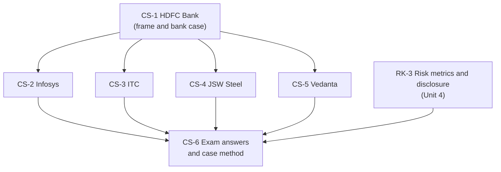

# Sustainable Finance Unit 5: Sustainable Investment Perspectives of Indian Corporates, node map

ESE: 50 marks, 3 × 5, 2 × 10, one compulsory 15-mark case. Unit 5 is the likeliest source of the case. The faculty deck fixes the frameworks: sustainable investment perspective, key risk metrics, IFRS S1 and S2, risk metrics vs disclosure, risks and challenges. Company nodes fill them with dated facts and carry a supplementary Cambridge risk-class line. No company figure is from the slides: check the latest report before quoting any number.

## Nodes

| Node | Topic | Deps | Minutes | Exam focus |
|---|---|---|---|---|
| CS-1 | HDFC Bank | none | 30 | yes |
| CS-2 | Infosys | CS-1 | 28 | yes |
| CS-3 | ITC | CS-1 | 30 | yes |
| CS-4 | JSW Steel | CS-1 | 30 | yes |
| CS-5 | Vedanta Ltd | CS-1 | 32 | yes |
| CS-6 | Exam Answers and the Case Method (with HUL) | CS-1 to CS-5, RK-3 | 45 | yes |

Total reading time: about 195 minutes. Read CS-6 first if short of time: it holds the slide frames, the nine-step method and the 5, 10 and 15-mark layouts, and the company nodes then work as evidence.

## Dependency graph

## Headline numbers and facts to know

- Slide chain: Investment → Financial return + ESG impact → Risk management → Resilience → Long-term value.
- IFRS S1 general (all material risks; cash flows, finance access, cost of capital); S2 climate, built on the four TCFD pillars.
- HUL CIA1 matrix: 14 indicators, total 24 → 22 (average 1.71 → 1.57); 12 unchanged, not 11.
- HUL royalty 2.65% → 3.45% of turnover: +30.2% relative; illustrative ₹60,000 crore turnover gives ₹1,590 crore → ₹2,070 crore.
- JSW illustrative SLB: 25 bps on ₹1,000 crore = ₹2.5 crore a year, ₹5 crore for years 4 and 5.
- Cambridge (2019): 6 classes (Financial, Geopolitical, Technology, Environmental, Social, Governance), 37 families, 175 risk types.

## Links
- [[Sustainable Finance MOC]]
- [[Sustainable Finance Unit 4 - RK-3 Risk Metrics Reporting and Disclosure]]
