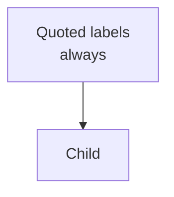

# Handoff: fork it, fill it, study on it

This is the full path from "I forked the repo" to "my notes are live on my own
site and my progress is tracked". The copy-paste prompts for generating notes
and question banks live in [PROMPTS.md](PROMPTS.md).

```
syllabus PDF ──► 1. distill ──► 2. node map ──► 3. notes (.md) ──► 4. question bank (.json)
                                                      │                     │
                                                      ▼                     ▼
                                     content/recall/<subject>/   content/tests/<subject>/
                                                      └────────► git push ──► Vercel redeploys
                                                                                   │
                                                          track R1/R2/R3, tests, errors, sync, duel
```

---

## 0. What you're getting

A Next.js 14 app (TypeScript, Tailwind) that reads Markdown study notes and
JSON question banks and turns them into:

- **Territory** (home): every topic grouped by unit, with a treemap and "up next".
- **Topic / Redraw / Reveal / Drill**: read a note, redraw its concept map from
  memory, reveal the real one, run its flashcards.
- **Practice**: per-topic mini tests, per-unit sectional tests, full mock papers.
- **Error book**: every lost mark, on a 1 → 3 → 7 day re-solve schedule.
- **Block**: 45 min study + 15 min error logging timer.
- **Standing / Timeline**: stats and an activity log.
- **Sync / Duel**: carry progress across devices, and a leaderboard with friends.

The in-app `/help` page explains each screen in plain terms.

---

## 1. Fork and run it locally

Prereqs: Node 18.17+ (20 recommended), git, a GitHub account.

1. On GitHub, open this repo and click **Fork**. Keep the name or rename it.
2. Clone your fork and install:
   ```bash
   git clone https://github.com/<you>/<your-fork>.git
   cd <your-fork>
   npm install
   npm run dev
   ```
3. Open http://localhost:3000. You'll see the subjects that ship with the repo
   (Taxation, Psychology, SAPM, Bond Market). That's the bundled content in
   `content/recall/`, which proves everything works before you add your own.

Without any `.env` file the app runs fully local: progress lives in your
browser's localStorage. That's fine for trying it out.

---

## 2. Make it yours (one-time cleanup)

| What | Where | Do this |
|---|---|---|
| Existing subjects | `content/recall/*`, `content/tests/*` | Delete the subject folders you don't want. Each folder = one subject tab. |
| Default subject | `src/lib/subject/shared.ts` → `DEFAULT_SUBJECT` | Set to your main subject's folder slug (e.g. `"microeconomics"`). If that folder doesn't exist, first-time visitors land on an empty page. |
| Tab labels | same file → `LABEL_OVERRIDES`, `ACRONYM_WORDS` | Folder `bond-market` shows as "Bond Market" automatically. Only add an override if the auto label looks wrong (e.g. `"os": "Operating Systems"`). |
| Backup URL | `BACKUP.md` | Replace `ahhh-one.vercel.app` with your own domain once deployed. |
| Personal scratch | `.scratch/` | Safe to delete; it's the previous owner's working file. |

Folder slugs must be lowercase letters, digits and hyphens (`my-subject`, not
`My Subject`), or the subject cookie rejects them.

---

## 3. How content is laid out (the contract)

```
content/
  recall/
    <subject-slug>/          ← one folder per subject = one tab
      <Unit> - <Title>.md    ← topic notes (tracked) + MOCs/cheat sheets (not tracked)
  tests/
    <subject-slug>/
      <anything>.json        ← question banks, any number of files, merged
```

### Topic notes (`.md`)

A file becomes a **tracked topic** only if its frontmatter has `node:`. Files
without it (MOCs, cheat sheets, reference sheets) are ignored by the app but
still fine to keep for Obsidian.

````markdown
---
title: "Unit 3A — HP-3 GAV and NAV"
type: recall
node: HP-3              # REQUIRED. Unique ID within the subject. Questions point at this.
section: "3.3"          # optional display label
minutes: 35             # study-time estimate; drives the treemap and "minutes remaining"
deps: [HP-2]            # node IDs that should be studied first
exam_focus: true        # flags high-yield topics
state: unstudied        # unstudied | studied | mapped | drilled (initial state only)
tags: [my-subject, recall, unit-3a]
---

# HP-3 — Computation of GAV and NAV

Covers: one-line scope. (Everything before the first ## becomes the "Overview".)

## Any heading
Body. Every `##` becomes a section in the reading view.

## Concept Map


## Flashcards
Q: Question on one line?
A: Answer on one line.
````

Rules the parser actually enforces (`src/lib/vault.ts`):

- **The unit comes from the filename**: everything before the first ` - `
  (space-hyphen-space). `Unit 3A - HP-3 GAV and NAV.md` → unit `Unit 3A`.
  `GP1 - Unit 4 Learning.md` → unit `GP1`. Units sort naturally (1, 2, 3A, 3B, 10).
- `## Concept Map` is **hidden while reading** and only shown on Reveal, so the
  redraw-from-memory step works. Only the first ```` ```mermaid ```` block is used.
- `## Flashcards` is stripped from the reading view and turned into cards.
  Each card is a `Q:` line followed by an `A:` line, one line each.
- `minutes` falls back to `weight × 15`, then 30.
- Headings are exactly `##` (two hashes). `###` stays inside its parent section.

### Question banks (`.json`)

Each file is a JSON **array** of questions. All files in the subject folder
are merged; duplicate `id`s are dropped (first one wins).

```json
[
  {
    "id": "HP-3-01", "node": "HP-3", "unit": "Unit 3A",
    "type": "mcq", "marks": 1, "difficulty": "easy",
    "question": "Markdown allowed.",
    "options": ["A) ...", "B) ...", "C) ...", "D) ..."],
    "answer": "B",
    "explanation": "Why B."
  },
  {
    "id": "HP-3-05", "node": "HP-3", "unit": "Unit 3A",
    "type": "short", "marks": 5, "difficulty": "medium",
    "question": "...",
    "model_answer": "Markdown, can use **bold**, lists, tables.",
    "marking_scheme": [
      { "point": "Point the examiner looks for", "marks": 1 }
    ]
  }
]
```

- `type`: `mcq` (1 mark, auto-marked), `short` (5), `long` (10), `case` (15).
- `node` must match a note's `node:` exactly, and `unit` must match that
  note's filename prefix exactly (`"Unit 3A"`, not `"Unit 3a"` or `"3A"`), or
  the question shows up under a phantom unit.
- `marking_scheme` marks should add up to `marks`.

**How many questions you need** (from `src/lib/paper.ts`):

| Paper | Pulls | Minimum pool |
|---|---|---|
| Mini test | every question for one node | 3–5 per node is comfortable |
| Sectional | 8 MCQ + 3 short + 2 long from one unit | per unit: ≥8 MCQ, ≥3 short, ≥2 long |
| Full mock | 5 short + 3 long + 1 case across all units | whole bank: ≥5 short, ≥3 long, ≥1 case (more = more variety) |

The paper still builds with fewer; it just shows a "pool has only N" note.

---

## 4. Generating the content with Claude

Full prompts are in **[PROMPTS.md](PROMPTS.md)**. The pipeline:

1. **Distill** the syllabus: paste the syllabus PDF/text, get a clean
   unit → topic list with hours (the previous owner's example is
   `.scratch/prathyu-sem1-distilled.md`).
2. **Node map**: split each unit into study-sized nodes (30–50 min each) with
   IDs, deps and exam focus. Output is a MOC note.
3. **Notes**: one note per node, in the exact format above. Run once per node
   (or per unit if nodes are small).
4. **Question bank**: one JSON file per unit, covering every node.
5. **Fact-check pass** (strongly recommended for law, finance, numericals):
   have a fresh Claude session audit notes and answer keys against the
   syllabus and textbook, and fix what it finds.

Tip: do steps 3–5 in a Claude Project with the syllabus and textbook chapters
uploaded as project knowledge, so every note is grounded in your actual
course material rather than general knowledge.

---

## 5. Two ways to keep notes: Obsidian (live) or repo-only

### Option A: repo-only (simplest)

Save generated files straight into `content/recall/<subject>/` and
`content/tests/<subject>/`. That's it.

### Option B: Obsidian vault as the source of truth (how the original was built)

Keep notes in an Obsidian vault with a `Recall/` folder laid out the same way
(`Recall/<subject>/*.md`), so you can edit them in Obsidian and see changes
instantly in the local app.

1. Copy `.env.example` to `.env.local` and set:
   ```
   VAULT_RECALL_PATH=/absolute/path/to/Vault/Recall
   ```
   (Windows: `C:\Users\you\Obsidian\Vault\Recall`.)
2. `npm run dev`. Notes are now read live from the vault on every page load,
   and marking topic states locally writes `state:` back into the frontmatter.
3. The deployed site can't see your laptop, so before each deploy copy the
   vault into the repo:
   ```bash
   # macOS/Linux
   rsync -a --delete "/path/to/Vault/Recall/<subject>/" "content/recall/<subject>/"
   ```
   ```powershell
   # Windows
   robocopy "C:\path\to\Vault\Recall\<subject>" "content\recall\<subject>" /MIR
   ```

Question banks always live in the repo (`content/tests/`), never the vault.

---

## 6. Uploading: getting new notes onto the site

Any push to your fork's default branch redeploys the site (once step 7 is done).

**From the terminal:**
```bash
npm run build                      # optional but catches broken files before Vercel does
git add content/
git commit -m "Add Unit 3 notes and question bank"
git push
```

**From the GitHub website (no terminal needed):**
1. Open your fork → navigate to `content/recall/<subject>/` (create it by
   typing the path in "Add file → Create new file" if it doesn't exist).
2. **Add file → Upload files**, drag in the `.md` files, **Commit changes**.
3. Same for the `.json` banks under `content/tests/<subject>/`.

Vercel picks it up in about a minute. New subject folders appear as new tabs
automatically.

---

## 7. Deploy your own copy (Vercel, free tier)

1. Go to https://vercel.com → **Add New → Project** → import your fork.
   Framework preset is detected as Next.js; no build settings to change.
   Do **not** set `VAULT_RECALL_PATH` on Vercel.
2. Deploy. The site works now, with progress stored per-browser only.
3. Turn on **sync** (needed for cross-device progress, Timeline and Duel):
   - Project → **Storage** → create/connect a **Redis** database (Redis Cloud
     or Upstash for Redis; both free tiers are enough).
   - Vercel injects `REDIS_URL` (or `KV_REST_API_URL` + `KV_REST_API_TOKEN`)
     automatically. `src/lib/sync/kv.ts` supports either.
4. Set **`BACKUP_SECRET`** under Project → Settings → Environment Variables
   to a long random string (`openssl rand -hex 32`). Required for
   `/api/backup`.
5. Redeploy (Deployments → ⋯ → Redeploy) so the new env vars take effect.

To sync while running locally too, copy the same `REDIS_URL` (or the REST
pair) into `.env.local`.

---

## 8. Tracking progress on the site

- **Rounds**: every topic goes R1 (read, redraw map, flashcards, mini test) →
  R2 (error-book revisit) → R3 (full mocks). Marking rounds sets topic state:
  R1 = studied, R2 = mapped, R3 = drilled. Territory's treemap and "up next"
  follow from that.
- **Sync across devices**: click **Sync** in the top bar → copy the
  `/?sync=<key>` link → open it on your phone. Both devices now share one
  record. Anyone with that link can read and write it, so treat it like a
  shared-doc link.
- **Duel with friends**: on `/duel`, pick a display name. Everyone who joins
  on the same deployment shows on the leaderboard, ranked by drilled count
  for the currently selected subject. If you want to duel the original owner,
  you both need to be on the same deployment; your fork has its own
  separate leaderboard.
- **Backups**: Redis has no history. Before touching storage settings, pull a
  snapshot (see [BACKUP.md](../BACKUP.md)). The Error book page also has a
  per-browser JSON export/import.

---

## 9. Troubleshooting

| Symptom | Cause |
|---|---|
| Note doesn't appear on Territory | No `node:` in frontmatter, or frontmatter isn't the very first thing in the file (`---` on line 1). |
| Topic lands in a weird unit | Filename missing the ` - ` separator, or inconsistent prefix (`Unit 3` vs `Unit 03`). |
| Questions under a unit with no topics | Question `unit` doesn't exactly match the note filename prefix. |
| Mini test empty for a topic | No question has `node` equal to that note's `node:`. |
| Whole question file ignored | Invalid JSON (trailing comma, unescaped quote/newline). Run it through a JSON validator; `npm run build` won't catch this. |
| Some questions silently missing | Missing `id`/`node`/`unit`/`question`, bad `type`, or a duplicate `id`. |
| Concept map shows an error | Mermaid syntax: wrap every label in `"..."`, use `<br/>` not newlines, avoid bare `()` `[]` in labels. |
| Flashcards count is off | `Q:` and `A:` must each be on a single line, `Q:` first. |
| Sync button says not configured | No Redis env var on this deployment, or you didn't redeploy after adding it. |
| Home page empty after deleting subjects | `DEFAULT_SUBJECT` still points at a deleted folder. |
