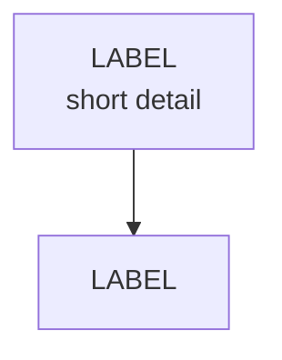

# Prompt handbook

Copy-paste prompts for turning a syllabus into notes and question banks this
app can read. Format rules are in [HANDOFF.md §3](HANDOFF.md#3-how-content-is-laid-out-the-contract);
these prompts already bake them in.

**Setup that makes every prompt better:** create a Claude Project per subject
and upload the syllabus, the textbook chapters / class notes, and past papers
as project knowledge. Then run each prompt below as its own chat inside that
project. Fill in everything in `<ANGLE BRACKETS>`.

| # | Step | Input | Output | Saved to |
|---|---|---|---|---|
| 1 | Distill | syllabus PDF/text | clean unit → topic list | your scratch file |
| 2 | Node map | distilled syllabus | node IDs, deps, minutes; MOC note | `content/recall/<subject>/<Subject> MOC.md` |
| 3 | Notes | node map + course material | one `.md` per node | `content/recall/<subject>/` |
| 4 | Question bank | the unit's notes | one `.json` per unit | `content/tests/<subject>/` |
| 5 | Fact-check | notes + bank + sources | corrections list, fixed files | overwrite the files |
| 6 | Cheat sheet (optional) | a unit's notes | one-page summary | `content/recall/<subject>/` |

---

## 1. Distill the syllabus

```text
Here is the official syllabus for <COURSE CODE — COURSE NAME>.

Distill it into a clean Markdown outline:
- One "## Unit <N> — <Unit title> (<hours> Hours)" heading per unit, in syllabus order.
- Under each, a flat bullet list of every topic and sub-topic exactly as the syllabus
  names them. Split comma-separated lists into separate bullets. Do not add, merge,
  or drop anything, and do not explain anything yet.
- Keep the "Objectives" section at the top if there is one.
- Below the units, add "## Exam pattern" with the paper structure (sections, marks,
  choices, duration) if the syllabus or past papers state it.

Output only the Markdown.

<PASTE SYLLABUS OR ATTACH PDF>
```

---

## 2. Build the node map

A **node** is one sitting of study (30–50 minutes). Small units can be a single
node; heavy units split into several.

````text
Using this distilled syllabus for <SUBJECT>, plan the study nodes.

Rules:
- Split each unit into nodes of roughly 30–50 minutes of focused study. A light unit
  can be one node.
- Give every node a short unique ID: <PREFIX>-<n>, e.g. HP-1, HP-2 or GP1-U4. IDs are
  unique across the whole subject.
- Decide the unit label every file in that unit will start with, e.g. "Unit 3A" or
  "GP1". It must be identical for every node in the unit.
- For each node give: ID, unit label, title, syllabus topics covered, minutes,
  deps (IDs that must come first), exam_focus (true if central or frequently examined).
- Filename for each node: "<unit label> - <ID> <Title>.md", e.g.
  "Unit 3A - HP-3 GAV and NAV.md". No characters that are illegal in filenames
  (: / \ ? * " < > |).

Output two things:
1. A table of all nodes with the columns above.
2. A MOC note in this exact shape (no `node:` field, so the app ignores it):

```markdown
---
title: <Subject> MOC
type: moc
tags: [<subject-slug>, moc, recall]
---

# <Subject> — Map of Content

## <Unit label> — <Unit title>
- [[<filename without .md>]] — one-line scope
...

## How the units are ordered
<one paragraph on the dependency chain and which nodes are exam focus>
```

<PASTE DISTILLED SYLLABUS>
````

Save the MOC as `content/recall/<subject>/<Subject> MOC.md`. Keep the table
open; you'll feed rows from it into step 3.

---

## 3. Write a topic note (run once per node)

````text
Write the recall note for node <ID> of <SUBJECT>.

Node: <ID>
Unit label: <UNIT LABEL>
Title: <TITLE>
Syllabus topics to cover: <PASTE THE TOPICS FROM THE NODE MAP ROW>
Minutes: <MINUTES>
Deps: [<DEP IDS or leave empty>]
Exam focus: <true/false>
Filename: <UNIT LABEL> - <ID> <TITLE>.md

Ground everything in the course material in this project. Where the textbook and
general knowledge differ, follow the textbook and say so. Flag anything you are
not sure of with "(verify)" rather than guessing.

Writing style:
- Explain like a sharp tutor, not a glossary. Say WHY a rule exists, then the rule.
- Bold the terms and figures an examiner would look for.
- Call out common exam traps explicitly.
- For numerical subjects: include the standard computation format and at least two
  fully worked illustrations.
- Cover every listed syllabus topic; don't pad beyond them.

Output exactly one Markdown file, starting on line 1 with the frontmatter, in this
structure and nothing else:

```markdown
---
title: "<UNIT LABEL> — <ID> <TITLE>"
type: recall
status: active
created: <YYYY-MM-DD>
source: claude-session, <what it was based on>
tags: [<subject-slug>, recall, <unit-tag>]
node: <ID>
section: "<section number or unit number>"
minutes: <MINUTES>
deps: [<DEP IDS>]
exam_focus: <true/false>
state: unstudied
---

# <ID> — <Full title>

Covers: <one sentence listing what this note covers>.

## <Section heading>
<body>

## <Section heading>
<body>

(as many ## sections as the content needs; use ### inside them for sub-points)

## Concept Map



## Flashcards
Q: <question on ONE line>
A: <answer on ONE line>

Q: ...
A: ...
```

Hard rules:
- Headings are exactly "## ". No other "## Concept Map" or "## Flashcards" headings.
- Concept map: one mermaid block, graph TD, 10–20 nodes, EVERY label wrapped in
  double quotes, <br/> for line breaks, no raw parentheses or brackets outside quotes.
  It should let someone redraw the whole topic from memory.
- Flashcards: 8–15 cards. Each Q: and A: on a single line each, Q first, blank line
  between cards. No multi-line answers.
- Do not put the concept map or flashcards content anywhere else in the note.
````

**Batch variant:** if the unit's nodes are small, replace the first block with
the full list of that unit's node rows and add: *"Output one file per node,
each preceded by a line `=== FILE: <filename> ===`."* Then split them up when
saving.

---

## 4. Build a question bank (run once per unit)

````text
Build the question bank for <UNIT LABEL> of <SUBJECT>, from the notes attached /
pasted below (and the past papers in this project, if any).

Nodes in this unit: <ID1, ID2, ...>

Coverage:
- For EVERY node: at least 3 MCQs and 1 short-answer question.
- Across the unit: at least 8 MCQs, 3 short, 2 long. Add 1–2 case questions if the
  exam has a case/problem section.
- Mix difficulty: roughly 40% easy, 40% medium, 20% hard.
- MCQs should test the traps and distinctions called out in the notes, with
  plausible distractors, not trivia.

Output ONE valid JSON array and nothing else (no prose, no code fence). Schema:

MCQ:
{ "id": "<NODE>-<NN>", "node": "<NODE>", "unit": "<UNIT LABEL>", "type": "mcq",
  "marks": 1, "difficulty": "easy|medium|hard",
  "question": "<markdown>",
  "options": ["A) ...", "B) ...", "C) ...", "D) ..."],
  "answer": "<single letter>",
  "explanation": "<why the answer is right and the tempting wrong one is wrong>" }

Short / long / case:
{ "id": "<NODE>-<NN>", "node": "<NODE>", "unit": "<UNIT LABEL>",
  "type": "short|long|case", "marks": 5|10|15, "difficulty": "...",
  "question": "<markdown>",
  "model_answer": "<markdown: what a full-marks answer looks like>",
  "marking_scheme": [ { "point": "<one thing the examiner rewards>", "marks": <n> } ] }

Rules:
- "unit" is exactly "<UNIT LABEL>" on every question.
- "node" is one of the node IDs above, exactly as written.
- ids are <NODE>-01, <NODE>-02, ... numbered per node, never reused.
- marks: mcq 1, short 5, long 10, case 15. marking_scheme marks must sum to marks.
- Inside strings, use \n for line breaks and escape double quotes as \". No trailing
  commas. The output must parse with JSON.parse.

<PASTE THE UNIT'S NOTES>
````

Save as `content/tests/<subject>/<unit-slug>.json`, e.g. `unit-3a-house-property.json`.
Paste it into any JSON validator first; one bad comma drops the whole file silently.

---

## 5. Fact-check pass (fresh chat, same project)

Use a **new** chat so it isn't anchored on what it wrote.

```text
You are auditing study material for <SUBJECT> against the course sources in this
project. The student will be examined on this, so errors cost marks.

Check the attached notes and question bank for:
1. Wrong facts, figures, section numbers, dates, names, formulas.
2. Outdated rules (state which year/edition the source uses).
3. MCQs where the keyed answer is wrong, or more than one option is defensible.
4. Model answers or marking schemes that miss a point the syllabus expects.
5. Anything marked "(verify)" — resolve it.
6. Syllabus topics for this unit that aren't covered at all.

Output a table: File | Location (heading or question id) | Problem | Fix | Source.
Then output the corrected files in full, in the same formats, only for files that
changed.

<ATTACH/PASTE NOTES AND JSON>
```

---

## 6. Cheat sheet (optional, not tracked)

```text
From these notes for <UNIT LABEL>, write a one-page cheat sheet for the night
before the exam: every definition, figure, formula, section number and trap, as
terse bullets and small tables. Frontmatter must include title, type: cheatsheet
and tags, and must NOT include a "node:" field.

<PASTE NOTES>
```

Save as `content/recall/<subject>/<UNIT LABEL> - Cheat Sheet.md`. It stays
readable in Obsidian; the app ignores it.

---

## Quick checklist before pushing

- [ ] Every topic file starts with `---` on line 1 and has a unique `node:`.
- [ ] Filenames start with the unit label, then ` - `.
- [ ] Each note has `## Concept Map` (one mermaid block) and `## Flashcards` (`Q:`/`A:` pairs).
- [ ] Each JSON file parses, every question's `unit` and `node` match a note.
- [ ] `npm run dev`, open the subject tab, click through one topic, its Reveal, and its mini test.
