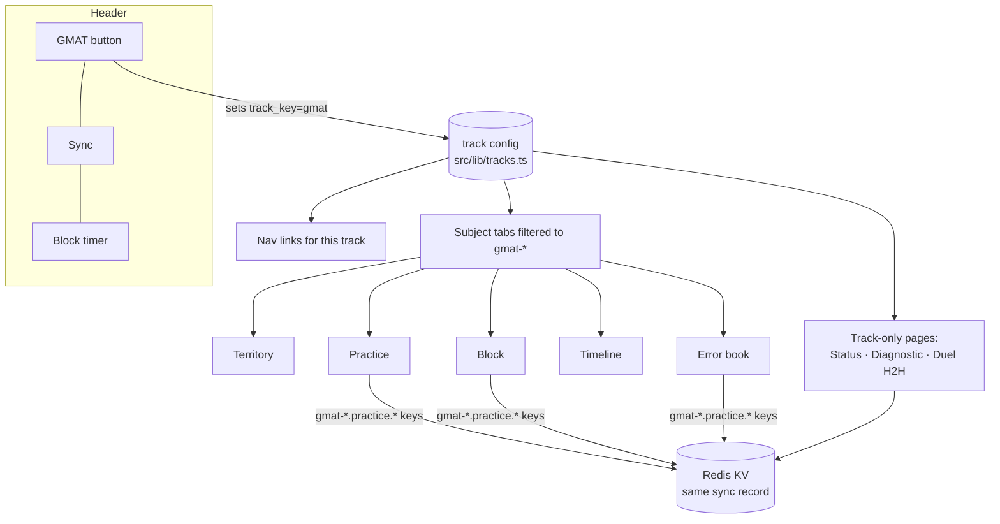
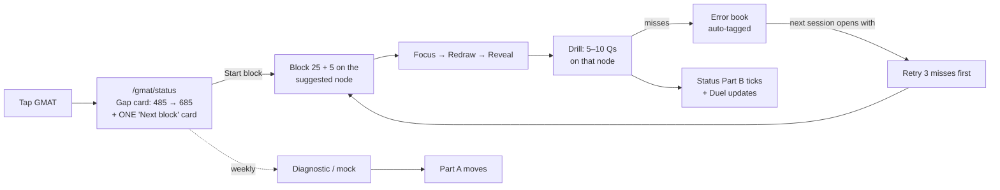

# PRD: GMAT section inside the AHH Study Planner

**Goal:** one tap on a **GMAT** button (left of Sync) puts Lokesh into GMAT mode. The same AHH loop (Territory, Practice, Block, Timeline, Error book) runs on GMAT content, and StudyDuel's Status/Delta screens and the Lokesh vs Nadeema duel come along unchanged. No second app, no login, no second link.

**Why now:** the ISB brief already named the risk: "GMAT prep gets deprioritised behind CIAs" because it lives in a separate app. One app with one sync link removes the context switch. Attempt 1 is pencilled for **Dec 2026**, about 10 weeks from today.

**Supersedes** the locked decision in `02 - UI Spec and Build Brief` that said "StudyDuel: stays separate and pure GMAT. Do not merge."

**Built so CAT drops in later:** GMAT is the first instance of a generic **track**. A CAT track (and its button) later means adding one config entry plus content folders, with no new code paths.

## Decisions log: 2026-10-04 (these override anything below)

| # | Decision |
|---|---|
| D1 | **Lokesh vs Nadeema is removed.** GMAT is multi-player: anyone onboards by tapping GMAT. Each player gets an **individual view** only. The **Versus** view (head-to-head across GMAT players) is visible **only to Lokesh**, identified by sync key (`VERSUS_OWNER_KEYS` env). ACCA/Nadeema is out of scope (Q1 closed). |
| D2 | **Neon stays** as the GMAT store (questions, attempts, diagnostics, players). KV storage limits are a future risk, so GMAT data does not go into KV. Section 2.5's "retire Neon" is void. |
| D3 | **Notes are distilled from online sources** (builder blogs, GMAT Club, prep-company blogs; no academic papers). Synthetic writing kept to an absolute minimum; every node cites its sources. A separate Opus agent owns notes. |
| D4 | **Exam: May/June 2027. Target: 685 (96th pct).** Q2, Q3 closed. |
| D6 | **Key system: players + device keys (Neon).** `profiles` gains `handle`, `role` (owner/player), `tracks[]`; new `device_keys` (key → player, label, last_seen, revoked_at). The existing sync key becomes a device key. Owner role (Lokesh) replaces the `VERSUS_OWNER_KEYS` env var. First GMAT tap asks one thing: your name. Later: 6-char one-time codes to link a new device. |
| D5 | Build model: this chat orchestrates (Opus); code is handed to Sonnet agents in chunks. |

---

## 1. What exists today

| | AHH Study Planner | StudyDuel (GMAT app) |
|---|---|---|
| Code | `D:\VibeCoding\study-planner` (Next 14) | `D:\Assam Internship\App\studyduel` (Next 16), **wrong drive location** per the VibeCoding rule |
| Live | Vercel, Redis KV (`ahhh:` keys) | `studyduelv2.vercel.app`, Neon Postgres |
| Identity | Sync link `/?sync=<key>` → `sync_key` cookie; name in `ahhh:names` | Player-picker cookie: `lokesh` / `nadeema`, no auth |
| Content | `content/recall/<subject>/*.md` nodes + `content/tests/<subject>/*.json` | 604 questions in Postgres (GMAT 524 / 19 topics, ACCA 80 / 4 topics) |
| Loop | Territory → Focus → Redraw → Reveal → Drill; Practice; Error book; Block 25+5; Timeline; Standing; Duel (rounds/drilled leaderboard) | Diagnostic sim (64-Q adaptive, IRT), **Status gap screen (Part A: where I stand / Part B: ground covered)**, topic tests, head-to-head chart, schedule |
| Real data | Per-person practice records in KV | **Almost none:** 2 profiles, 1 diagnostic (485, 2026-08-17) + 3 section rows, **0 tests, 0 attempts** |

The last row decides the strategy. With no tests or attempts recorded, there is no user history to reconcile. Merging means porting code and content, not migrating data.

Snapshot taken before any change: `D:\Lokesh\Christ\Y3\Y3\Second Brain\StudyDuel\Snapshots\archive\2026-10-04-pre-ahh-merge\` (also rotated into `current`).

---

## 2. How the merge works

### 2.1 The core idea: a track is a layer above subject

The planner already has a **subject** layer: a cookie (`subject_key`) chooses which `content/recall/<slug>` folder every page reads, and practice keys are namespaced `<subject>.practice.*`, which sync automatically. We add one layer above that:

```
track  (ahh | gmat | later: cat, acca)
  └── subject  (gmat-quant | gmat-verbal | gmat-di | gmat-strategy)
        └── unit → topic node
```



**`src/lib/tracks.ts`** (new, the only real new abstraction):

```ts
export const TRACKS = {
  ahh:  { label: "AHH",  subjects: (s) => !/^(gmat|cat|acca)-/.test(s), nav: AHH_NAV },
  gmat: { label: "GMAT", subjects: (s) => s.startsWith("gmat-"), nav: GMAT_NAV,
          exam: { date: "2026-12-??", scale: "gmat-focus" }, home: "/gmat/status" },
  // cat: { label: "CAT", subjects: (s) => s.startsWith("cat-"), nav: CAT_NAV, ... }   ← future, one entry
} as const;
```

- `track_key` cookie, same pattern as `subject_key`/`sync_key`: plain, 400-day, no secret.
- `SubjectTabs` shows only the subjects of the current track. `TopNav` reads `nav` from the track.
- Subject → track is derived from the **folder prefix**, so adding `content/recall/cat-quant/` puts it under CAT with nothing else to edit.

### 2.2 The GMAT button

- Sits **immediately left of Sync** in `TopNav`. It's a toggle: label `GMAT` in AHH mode and `AHH` in GMAT mode, with the active track shown in the same uppercase-tracked style as the nav.
- Tap → set `track_key`, go to the track's `home` (`/gmat/status`), and restore the **last subject used in that track** (stored per track, so switching back to AHH returns you to SFM, not Taxation).
- Future: CAT and ACCA become additional buttons in the same slot, shown only for tracks the person has enabled (see 2.4). With three or more tracks enabled the slot collapses into a small switcher.

### 2.3 Routing

| Route | Mode | Source |
|---|---|---|
| `/`, `/practice/*`, `/errors`, `/timeline`, `/block`, `/topic/*`, `/focus/*`, `/redraw/*`, `/reveal/*`, `/drill/*` | **shared**, track-aware via subject | existing AHH pages, unchanged |
| `/gmat/status` | GMAT only | port of StudyDuel `diagnostic/results` (Part A + Part B) |
| `/gmat/diagnostic` | GMAT only | port of StudyDuel `diagnostic` (64-Q adaptive sim) |
| `/duel` | shared page, track-aware board | AHH duel + StudyDuel head-to-head view when track = gmat |
| `/standing` | AHH only | folded into `/gmat/status` for GMAT |

GMAT nav: **Status · Territory · Practice · Error book · Timeline · Duel · Block** (+ Backup, Help in the overflow).

### 2.4 Identity: same person, same link

- **No login screen anywhere.** The person *is* their sync key, as in AHH today. Lokesh's existing AHH sync link opens the GMAT track too.
- StudyDuel's `lokesh` / `nadeema` player ids map onto sync keys through one KV record: `ahhh:people:<syncKey> = { name, tracks: ["ahh","gmat"], studyduelPlayer: "lokesh" }`. `ahhh:names` stays as is.
- `tracks` controls which buttons a person sees. Lokesh: `ahh, gmat`. Nadeema: `acca` (see open question Q1). Prathyu and other AHH users: `ahh`, no change for them.

### 2.5 Data: where each thing lives after the merge

| Data | Before | After |
|---|---|---|
| GMAT questions (524) | Neon `questions` | **`content/tests/gmat-<section>/<topic>.json`**, one-time export script. `mcq` → `mcq`; `data_sufficiency` → `mcq` with the two statements in the stem and the 5 standard DS options; `marks: 1` |
| Topic test results / attempts | Neon `tests`, `attempts` (empty) | AHH practice store `gmat-*.practice.*`, already synced through KV |
| Diagnostics (485 + 3 sections) | Neon `diagnostics`, `diagnostic_sections` | KV `gmat-strategy.practice.diagnostics.v1` (synced record; append-only list of sittings) |
| Target | `profiles.target_percentile = 96` | Track config + per-person override in the people record |
| Scoring math | `src/lib/gmat-scoring.ts` | **copied verbatim** (pure, no DB, validated: `totalScore(77,77,68) = 485`) |
| Schedule | Neon `schedule_events` (empty) | AHH Timeline (exam date + attempts as events) |
| Notes | none | `content/recall/gmat-*/*.md` (section 5) |

**Neon is retired** after the export, kept read-only as an archive. The rotated JSON snapshots stay in the vault. This removes a second database, the Neon password-rotation TODO, and the "anyone can sign in as either player" cookie hole.

### 2.6 What "preserved" means for Status and Delta

Port the StudyDuel gap screen faithfully, including its rules:

- **Part A, where I stand:** latest sitting (485 / 22nd), target (96th percentile → 685), required section sum, the per-section split from `derivePlan`. It changes only when a full-length is sat.
- **Part B, ground covered:** sessions per topic, last-5 median, first-to-last movement. Now computed from AHH practice records instead of Neon `tests`.
- **The units rule stays:** Part A is scaled points, Part B is quiz-accuracy percentage points, and only Part A is ever labelled "points". The two are never summed.
- **Delta** (StudyDuel's "improvement delta per topic") = Part B's first-to-last movement, also shown on the duel board.

---

## 3. User flow: least friction first

**Principle:** every screen answers "what do I do next?" with one button. No choosing, no logging, no typing scores.



### 3.1 Daily loop (the 90% path)

1. **Tap GMAT.** You land on `/gmat/status`. The top shows the gap in one line ("485 → 685 · need +31 scaled · DI is cheapest") and **one card: Next block**.
2. **Next block is chosen for you**, never picked from a list:
   - due error-book retries first (misses older than 2 days);
   - otherwise the lowest-band node in the **highest-leverage section** from Diagnostic 1's priority order: DS method → Rates/Ratios/Percent → CR analysis/inference → pacing;
   - the reason is shown in one line ("DS method: your weakest section's root cause").
3. **Start block** starts the existing 25 + 5 timer and opens that node's Focus view. There is no separate "start timer" step.
4. Focus → **Redraw the map** → Reveal → state = mapped. This is the existing AHH loop, unchanged.
5. **Drill rolls straight into 5–10 practice questions** from that node's bank, with no trip to Practice. Each miss goes to the Error book tagged to the node, and the 5-minute log phase opens on those misses.
6. Done. Part B and the duel board update from the synced record. Nothing to log by hand.

### 3.2 Weekly / checkpoint path

- **Full-length:** `/gmat/diagnostic` (in-app adaptive sim) or "Log an official mock" (3 numbers: QR, VR, DI; the total and percentile are computed). This is the only place a number is ever typed.
- Part A moves and the Next-block priorities re-derive from the new section split.

### 3.3 Duel path (passive)

- No action needed. `/duel` in GMAT mode shows the StudyDuel head-to-head: tests taken plus per-topic delta, x-axis = test number (not date, since the two schedules differ), hidden until both players have at least one test.

### 3.4 Switching back

- Tap **AHH** to return to your last AHH subject. The block timer keeps running across the switch; it belongs to the person, not the track.

### 3.5 Friction removed versus StudyDuel today

| StudyDuel today | Merged |
|---|---|
| Separate URL, pick a player card | Same link, same app, already signed in |
| Pick a topic, then start a test | Next block is pre-chosen with a reason |
| Test results live apart from notes | Questions hang off the node you just studied |
| No error book | Misses auto-tagged, retried first next session |
| No notes, only questions | Recall nodes with concept map + flashcards (section 5) |

---

## 4. Personas

| Persona | Needs | Gets |
|---|---|---|
| **Lokesh, GMAT** (primary) | Hit 685 alongside Y3 CIAs; one place to study | GMAT track + AHH track, one link |
| **Nadeema, ACCA** (duel opponent) | Keep competing; AAA + ATX practice | ACCA track (80 Qs migrated) **or** stays on StudyDuel: see Q1 |
| **Existing AHH users** (e.g. Prathyu) | Nothing changes | No GMAT button (tracks = `ahh` only) |
| **Future CAT user** | Same experience for CAT | `cat` track: config entry + `content/recall/cat-*` |

---

## 5. GMAT notes: the content plan

The notes use the existing node format: frontmatter `node, section, minutes, deps, weight, exam_focus, state`, a body, `## Concept map` (mermaid, hidden while reading), and `## Flashcards` (Q:/A:). The weights come from the dossier, the priorities from Diagnostic 1.

**28 nodes across 4 subjects.** Diagnostic-1 priority nodes are marked ★ and are written first.

### gmat-quant: Quantitative Reasoning (21 Q / 45 min, no calculator)
| Node | Topic | Dossier weight | QB topics mapped |
|---|---|---|---|
| Q-1 | Number properties: divisibility, primes, GCF/LCM, remainders, odd/even | 10–15% | Number Properties (36) |
| Q-2 | Arithmetic core: fractions, decimals, exponents, roots | 30–35% (with Q-3–Q-6) | Arithmetic (37) |
| Q-3 ★ | Percents and percent change | ″ | Percents (30) |
| Q-4 ★ | Ratio, proportion, mixtures | ″ | Ratio & Proportion (19) |
| Q-5 | Profit, loss, simple and compound interest | ″ | Profit & Loss (13) |
| Q-6 | Averages and weighted averages | ″ | Averages (14) |
| Q-7 | Linear equations and systems | 25–30% (with Q-8, Q-9) | Algebra (43) |
| Q-8 | Quadratics, exponents in algebra, functions, sequences | ″ | Algebra |
| Q-9 | Inequalities and absolute value | ″ | Algebra |
| Q-10 ★ | Rates, work, distance | 5–10% | Rates And Work (11) |
| Q-11 | Word problems: sets, overlapping groups, translation | ″ | Word Problems (40) |
| Q-12 | Statistics: mean, median, range, SD intuition | 15–20% (with Q-13) | Statistics (12) |
| Q-13 | Counting and probability | ″ | Probability And Counting (11) |

Geometry (20 Qs in the bank) is **off-syllabus in Focus**. Those questions are tagged `archived` and kept out of practice.

### gmat-verbal: Verbal Reasoning (23 Q / 45 min)
| Node | Topic | QB |
|---|---|---|
| V-1 | Argument anatomy: premise, conclusion, assumption | CR (61) |
| V-2 ★ | Assumption, strengthen, weaken | CR |
| V-3 ★ | Evaluate, boldface/role, flaw (Analysis/Critique, 18th pct) | CR |
| V-4 ★ | Inference and explain-the-discrepancy (Inferred Idea, 29th pct) | CR |
| V-5 | RC passage mapping and reading speed | RC (57) |
| V-6 | RC question types: main idea, detail, inference, function, tone | RC |

### gmat-di: Data Insights (20 Q / 45 min, calculator)
| Node | Topic | QB |
|---|---|---|
| D-1 ★★ | **DS method**: AD/BCE grid, judge sufficiency, don't solve (root cause of 68 / 14th) | DS (55) |
| D-2 ★ | DS traps: value vs yes/no, hidden constraints, "C-trap" | DS |
| D-3 | Table analysis | Table Analysis (18) |
| D-4 | Graphics interpretation | Graphics Interpretation (16) |
| D-5 | Two-part analysis | Two Part (14) |
| D-6 | Multi-source reasoning | MSR (17) |
| D-7 | DI triage: when to guess and move | — |

### gmat-strategy: Test strategy
| Node | Topic |
|---|---|
| S-1 | Scoring: 205–805, sections 60–90, linear in section sum, so a point counts the same in any section |
| S-2 | Section order, bookmark & review/edit (max 3 edits), never leave blanks |
| S-3 ★ | End-of-section pacing discipline (all 3 sections collapsed late) |
| S-4 | The felt-vs-actual mismatch: trust scores, not vibe, on DS |
| S-5 | ISB context: test-centre only, 5 attempts / 12 months, Dec 2026 Attempt 1, R1 Dec 2027 |

**Authoring order:** D-1, D-2, Q-3, Q-4, Q-10, V-2, V-3, V-4, S-3 first (about a week of nodes and exactly the Diagnostic-1 priority list), then the rest by dossier weight.
**Who writes them:** the `exam-notes-author` agent (node format) plus `exam-auditor` (recomputes every number), with the dossier and Diagnostic 1 as source material. Both agents are tuned for Christ BBA, so the brief has to say "GMAT Focus, not Christ".

---

## 6. Requirements

### Functional
- **F1** GMAT button left of Sync; toggles `track_key`; remembers last subject per track.
- **F2** `tracks.ts` config; nav, subject tabs and home all derive from it; adding a track = config entry + `content/recall/<prefix>-*` folders.
- **F3** One-time export: Neon GMAT questions → `content/tests/gmat-*/*.json` in the AHH `Question` shape, with an `archived` flag for Geometry.
- **F4** `/gmat/status` = StudyDuel Part A + Part B, units rule enforced.
- **F5** `/gmat/diagnostic` sim ported; results write to the synced diagnostics record.
- **F6** "Log official mock": 3 inputs, everything else derived.
- **F7** Next-block chooser: error-book retries, then lowest band in the highest-leverage section, with a one-line reason.
- **F8** Drill → node practice set → misses to error book, all in one flow.
- **F9** `/duel` in GMAT mode renders the head-to-head (tests taken + per-topic delta, x = test number).
- **F10** People record with `tracks[]`; the button shows only for enabled tracks.
- **F11** Timeline seeded with the GMAT Attempt-1 date and the ISB R1/R2 deadlines.

### Non-functional
- Zero change for AHH-only users (no button, same subjects, same keys).
- No new database; KV + content files only.
- Track switch < 300 ms, no full reload.
- The existing BACKUP/snapshot flow covers `gmat-*` keys automatically (they match the `<subject>.practice.*` pattern).

### Acceptance
- Lokesh's existing sync link → tap GMAT → sees 485 → 685 gap and a Next block, with zero setup.
- Finishing one block produces: node state moved, ≥5 questions answered, misses in the error book, Part B count +1. Nothing typed.
- Adding an empty `content/recall/cat-quant/x.md` + a `cat` config entry shows a CAT button for an enabled person.

---

## 7. Rollout

| Phase | Scope | Exit |
|---|---|---|
| **0** | Move StudyDuel repo to `D:\VibeCoding\studyduel` (VibeCoding rule); rotate the Neon password; snapshot (done 2026-10-04) | Repo builds from the new path |
| **1: Tracks** | `tracks.ts`, `track_key`, GMAT button, nav/subject filtering, people record | AHH unchanged; GMAT button shows an empty GMAT territory |
| **2: Content** | QB export (F3); first 9 ★ notes | GMAT Territory + Practice work end to end |
| **3: StudyDuel screens** | Status, Diagnostic, Log mock, Duel H2H, 485 imported | Acceptance criteria pass |
| **4: Friction pass** | Next-block chooser, drill → practice → error book chain | One-button daily loop |
| **5: Retire** | StudyDuel Vercel → redirect to planner; Neon read-only | One app |
| Later | CAT track (vault planning first), ACCA track | Config + content only |

## 8. Risks

- **Two Next.js versions** (14 vs 16): port components, don't copy the app. StudyDuel's pages are small. Recharts must be added to the planner.
- **DS questions in an MCQ shape:** the 5 standard DS options are fixed text; the explanation has to cover each statement alone.
- **Bank quality is unaudited:** run `exam-auditor` on the export before it goes into practice.
- **Error book volume:** 524 questions could flood it. Retry queue capped at 3 per session.

## 9. Open questions

- **Q1 Nadeema.** Give her an ACCA track in the planner (80 Qs migrate, duel stays live), or keep StudyDuel running just for her until Phase 5? *Recommendation: ACCA track. It costs one config entry, and the duel only works if both people are in one store.*
- **Q2 Exam date.** The ISB brief says Attempt 1 in **Dec 2026** (target 665–675); the StudyDuel checkpoint says **~May/June 2027** with a 685 floor. Which date does Timeline count down to?
- **Q3 Target.** Keep the 96th-percentile floor (685), or the brief's 675 (≈ ISB YL average 677)?
- **Q4 CAT scope.** When CAT comes, does it share the duel board with GMAT, or does it get its own?

---

## Sources (local)
- `D:\Lokesh\Christ\Y3\Y3\Second Brain\Research - GMAT Focus Edition Dossier - 2026-08-14.md`
- `D:\Lokesh\Christ\Y3\Y3\Second Brain\GMAT Diagnostic 1 - 2026-08-17.md`
- `D:\Lokesh\Christ\Y3\Y3\Second Brain\Brief - ISB YLP Strategy - 2026-08-14.md`
- `D:\Lokesh\Core\Second Brain\StudyDuel - Scaffold Checkpoint.md`
- `D:\Lokesh\Core\Second Brain\Study Planner\02 - UI Spec and Build Brief.md`
- Code: `src/components/TopNav.tsx`, `src/lib/subject/*`, `src/lib/sync/shared.ts`, `src/app/api/duel/route.ts`, `src/lib/question-types.ts`
